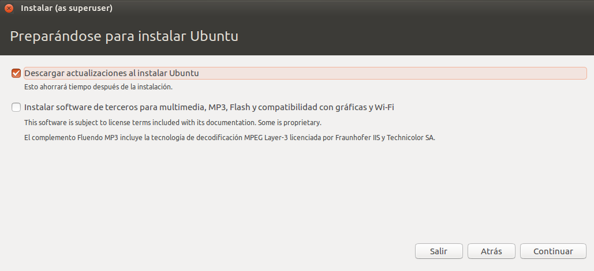
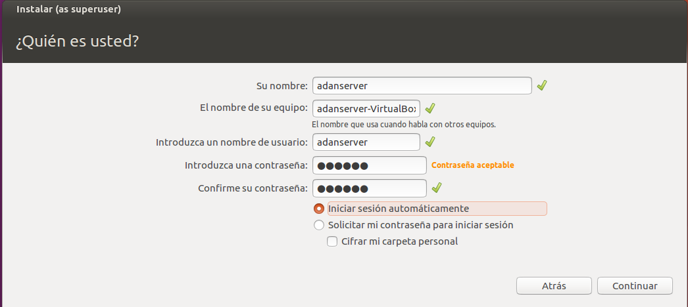
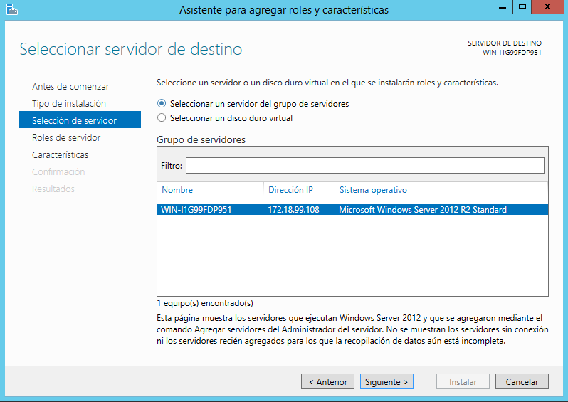
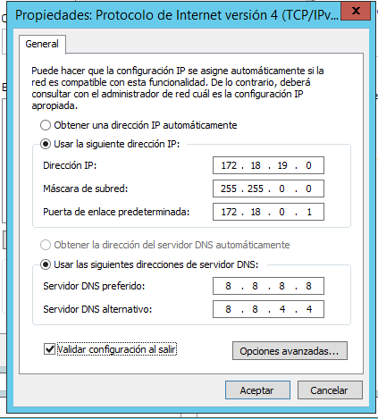
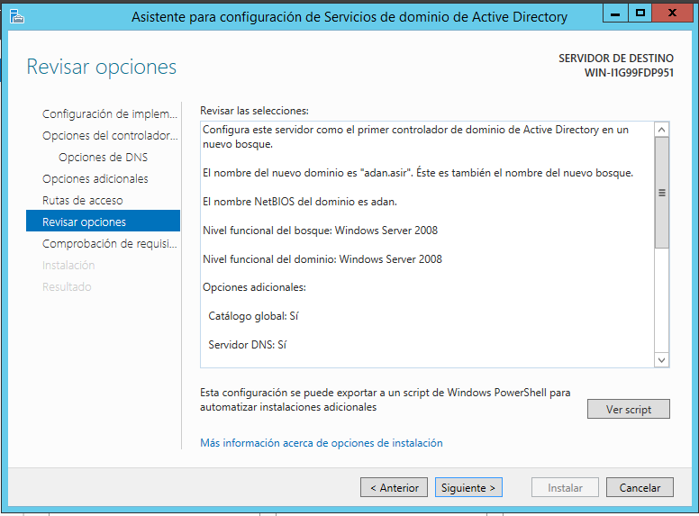
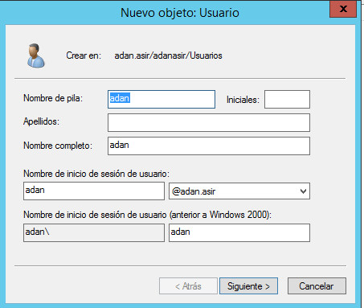

# **Instalaciones y configuraciones**

# 1. Creamos las máquinas

Y procedemos a instalar sus respectivos sistemas operativos.

 

 >Windows 10 Cliente = 2048 RAM, 32GB Dinámicos, Adaptador puente

 >Windows Server 2012 = 4096 RAM, 32GB Dinámicos, Adaptador puente

>UbuntuCliente = 1024 RAM, 15GB Dinámicos, Adaptador puente

>UbuntuServer = 2048 RAM, 15GB Dinámicos, Adaptador puente

# 2. Ubuntu

- Insertamos una ISO de **Ubuntu** en la máquina de *Cliente* y en la de *Servidor*, iniciamos y a continuación empezamos a instalar.

- Y por último cambiamos la IP de la máquina servidor, editando así una IP dentro del rango disponible

# 3. Windows

- Al igual que en *Ubuntu*, tenemos que insertar las ISOS de **Windows** en dichas máquinas y hacemos la instalación.

- Instalamos el ***Active Directory*** en el servidor.

- Antes de seguir con la instalación de ***Active Directory*** configuramos la IP de dicha máquina, dentro de un determinado rango.

- Seleccionamos Servicios de dominio de Active Directory, que es lo que nos interesa.

- Y creamos por último el dominio en el que entraremos con el cliente.

- Ahora en el ***CLIENTE*** tenemos que cambiar nuestra IP, dejando la dirección automáticamente por el servidor, y asignando en direcciones DNS como preferido la IP de la máquina **servidor**, y como secundaria, por ejemplo, la de google.

>Después de esta acción, vamos a Equipo>Propiedades>Cambiar y ponemos el nombre del dominio que creamos en el servidor, en mi caso es adan.asir, y te pedirá un *Usuario* y *contraseña*, que ahí lo rellenaremos con los datos de nuestro usuario administrador del **servidor**.

- Unidades Organizativas

>Vamos a crear una unidad organizativa, en la cual meteremos dentro un usuario y un grupo para poder iniciar sesión en el servidor.

Pinchamos sobre *Inicio > Herramientras Administrativas > Usuarios y grupos de Active Directory* y una vez dentro, seleccionamos nuestro servidor, click derecho y *Nuevo > Unidad Organizativa*

>Ponemos el nombre que queramos para la unidad organizativa, en mi caso la llamé *adanasir*, igual que el servidor.

Una vez listo, Click derecho sobre la carpeta de la UO *(Unidad organizativa)* > Nuevo > Unidad Organizativa, pero en este caso,
haremos dos, una llamada **Usuarios** y otra llamada **Grupos**

En la *UO* de **Usuarios**, como es obvio, creamos los usuarios, cuyo nombre nos va a servir para iniciar sesión luego en la máquina cliente, al igual que su contraseña.

Y en la *UO* Grupos, creamos el grupo, dejando los campos por defecto y llamándolo como queramos.

Vamos a las *propiedades* del grupo e insertamos al usuario que creamos anteriormente.

- En la máquina **cliente** ahora iniciamos sesión con el usuario que hayamos creado, en mi caso fue adan.asir\adan, y su respectiva contraseña.

>adan.asir\adan viene del nombre del dominio + usuario, primero ponemos el nombre del dominio  y luego separado por la barra, el nombre del usuario, y ya estamos dentro.

