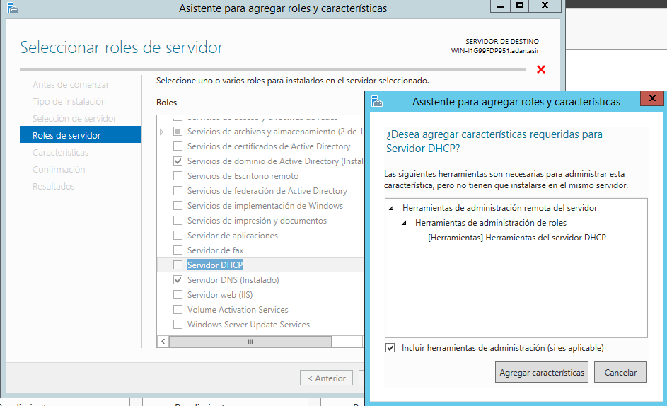
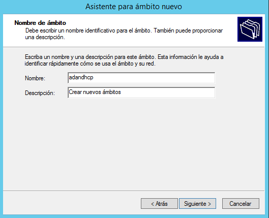

# Instalación y configuración **DHCP** en *Windows 2012 Server*

* Antes de empezar, tenemos que asegurarnos de tener una máquina con *Windows 2012 Server* configurada con sus IPs
  - La IP del servidor es *172.18.19.0*
   - La máscara es la predeterminada por la clase
   - Y la puerta de enlace es *172.18.19.1*

