# Informe IIS - Servidor Web avanzado - PHP, MySQL, phpMyAdmin, FTP y Drupal

* Vamos a realizar las instalaciones y configuraciones necesarias para obtener un Servidor Web con soporte PHP y accesos a bases de datos relacionales, acceso FTP y gestor de bases de datos. Sobre este servidor, podremos realizar instalaciones de aplicaciones integradas (CMS, e-commerce, etc)
u
* Siguiendo los pasos detallados en las guías y tutoriales, instala soporte para PHP para tus sitios Web gestionados por IIS. Recomendado PHP 5.x VCx Non Thread-Safe (con IIS Fast CGI).

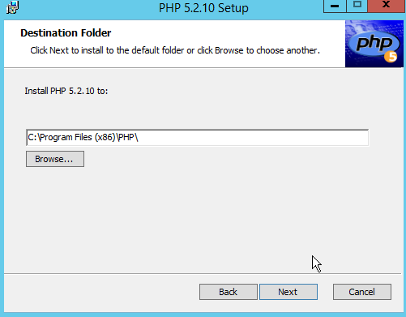

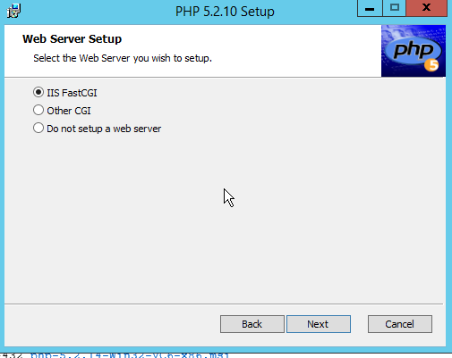

* Configuramos el servidor

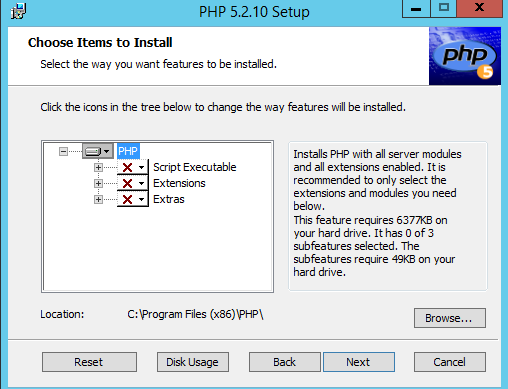

* Comprobar la instalación correcta de PHP colocando un fichero index.php en el sitio web destinado
a gestionar el CMS Drupal (www.miEmpresa.com ó miEmpresa\principal) con el siguiente código:
`<?php phpinfo(); ?>`

* Siguiendo los pasos detallados en las guías y tutoriales, instala el servidor de bases de datos relacionales MySQL para tus sitios Web gestionados por IIS.

  * Descargar e instalar .NET Framework 4.0.
  * Instalar MySQL y complementos necesarios.

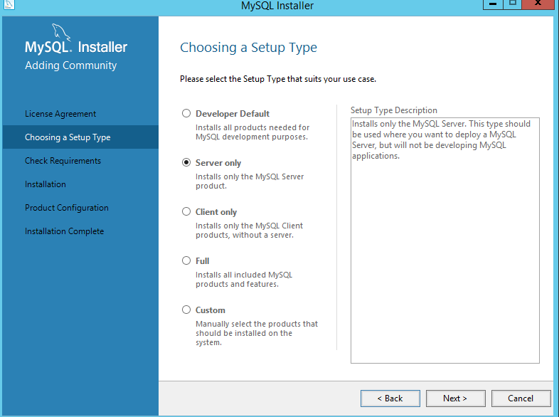

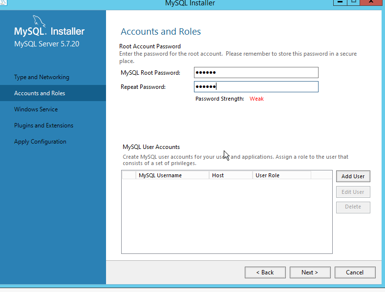

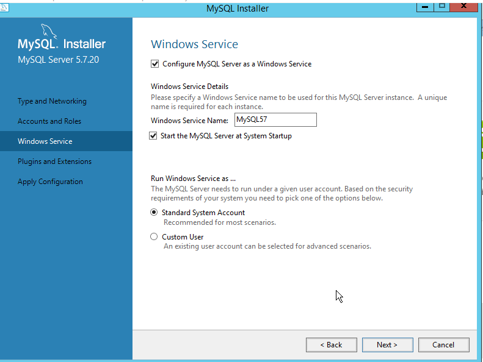

* Siguiendo los pasos detallados en las guías y tutoriales, instala PHPMyAdmin para tus sitios Web gestionados por IIS. Para esto debes crear un nuevo sitio web asociado a `phpmyadmin.miEmpresa.com`, recordando crear la correspondiente carpeta (donde descomprimirás los ficheros de phpMyAdmin) y actualizar DNS.

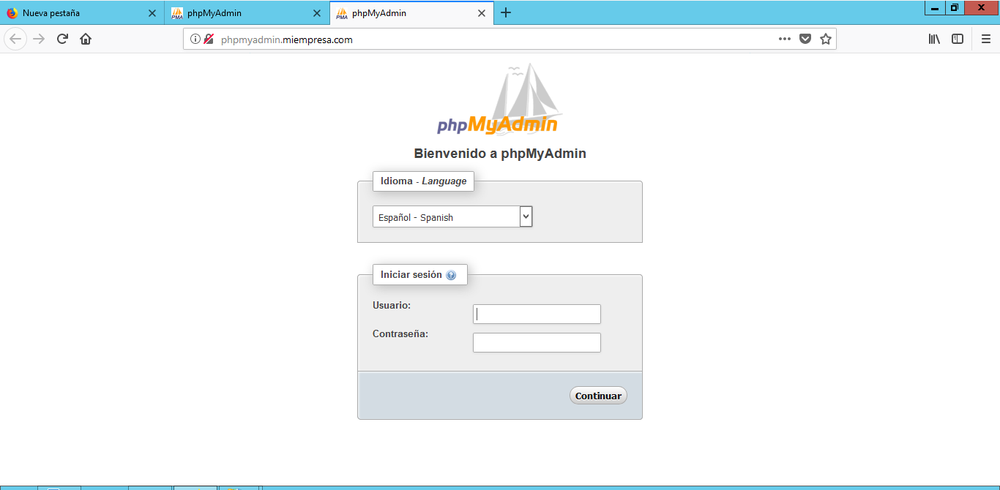

* Siguiendo los pasos detallados en las guías y tutoriales proporcionados:
  * Instalar Servidor FTP FileZilla en Windows 2012 Server.

  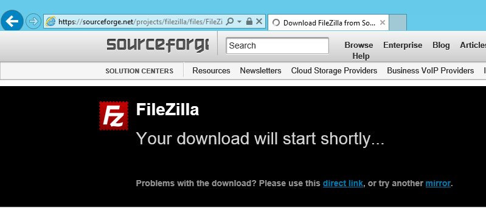

  

  

  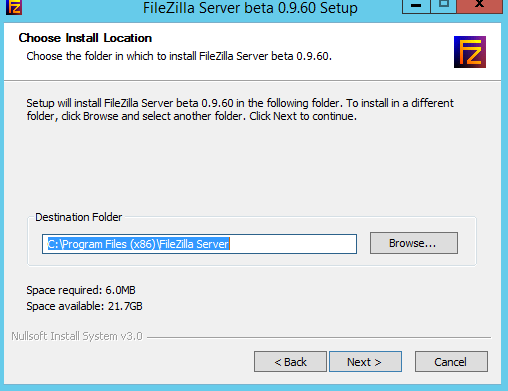

  

  * Crear un usuario denominado ftpuser en el Servidor FTP y asociarle a este usuario permisos de Control Total sobre la carpeta en la que se va a instalar el CMS de miEmpresa.

  

  *  Crear un nuevo registro DNS que permita acceder a nuestro sitio FTP a través de la dirección `ftp.miEmpresa.com`.

  

  

* A partir de este punto, salvo problemas de difícil solución, todo el trabajo deberá realizarse en modo remoto, desde el cliente Windows 7:
  * Comprobar acceso a phpMyAdmin desde un navegador (phpmyadmin.miEmpresa.com).

    
  * Descargar CMS Drupal de drupal.org.

  * Comprobar el acceso al sitio FTP creado a través de un navegador y con el usuario ftpuser.

  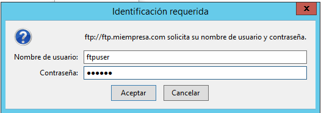

  
  * Instalar un cliente ftp (p.e.: FileZilla) en Windows 7 para poder realizar todas las operaciones sobre los ficheros y carpetas del servidor web.

  

  

  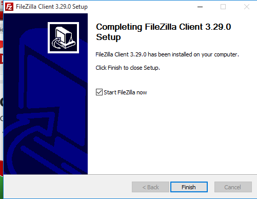

  * Descomprimir y subir archivos Drupal a carpeta principal (www.miEmpresa.com).

  

  * Crear una nueva base de datos, denominada cms, a través de phpMyAdmin.

    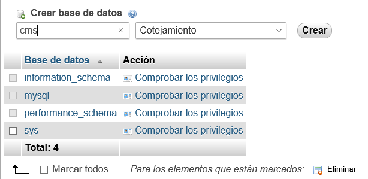

    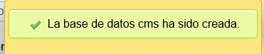
  * Crear usuario cms y asignar todos los privilegios para la base de datos anterior.

  

  

  * Instalar CMS Drupal desde el navegador siguiendo los pasos y consultando documentación en Internet.

  

  

  

  * Configuración y creación del sitio Drupal: configurar idioma español; instalar módulo gtranslate y habilitar traducción a varios idiomas;

  

  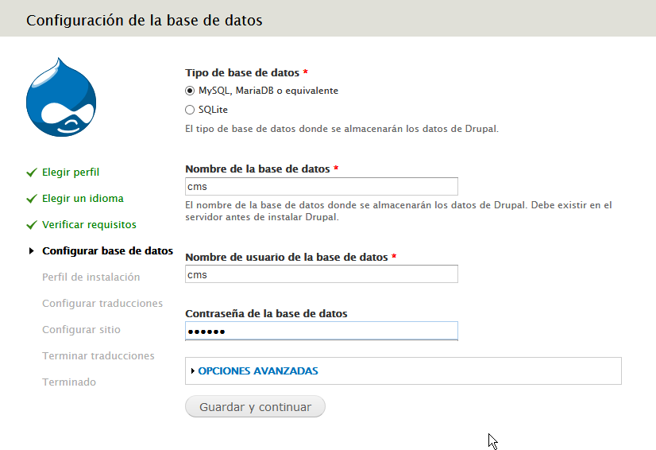

  

  

  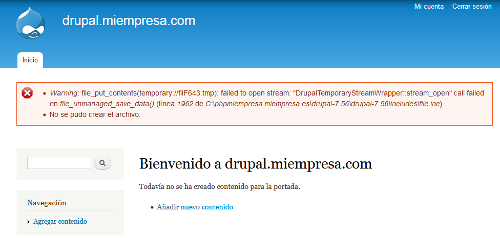

  * Instalar y configurar temas Marinelli, Zen y Fusion.

  * Crear dos o tres páginas de contenido, crear menú Primary Links y colocar como bloque. Otras opciones de configuración que desees.  

  

  * Elige una de las siguientes aplicaciones web integradas basadas en software libre y realiza, en grupos de hasta tres alumnos, su instalación y configuración en tu servidor web, siempre en modo remoto, desde el cliente W7.

  * Utilizamos Wordpress.

  

  

  

#### Trabajo Realizado por Sergio de la Barrera García y Adán Pérez García.
