# Instalación y configuración **DHCP** en *Windows 2012 Server*

* Antes de empezar, tenemos que asegurarnos de tener una máquina con *Windows 2012 Server* configurada con sus IPs
  - La IP del servidor es *172.18.19.0*
   - La máscara es la predeterminada por la clase
   - Y la puerta de enlace es *172.18.19.1*
   - En el VirtualBox, ambas máquinas tienen que tener **Red interna** con el nombre de *red-interna*.

* Nos movemos para > *Asistente para agregar roles y características*, donde empezaremos a crear/configurar el **servicio dhcp**.

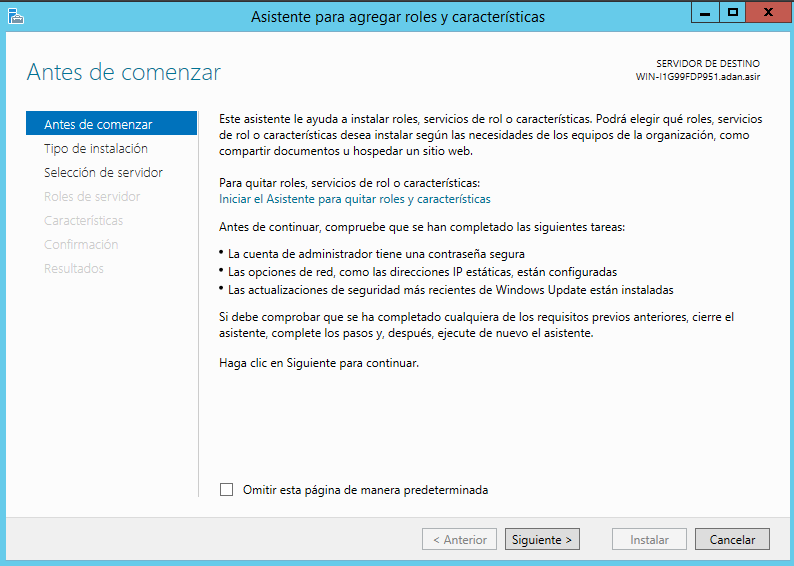

* Nos basaremos en pulsar **siguiente** hasta que tengamos que cambiar algo que nos afecte en el servicio.

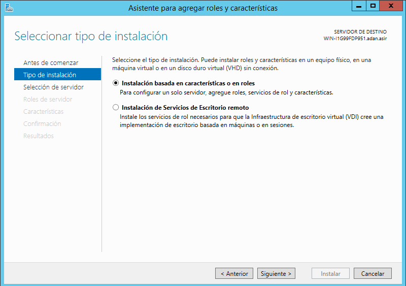

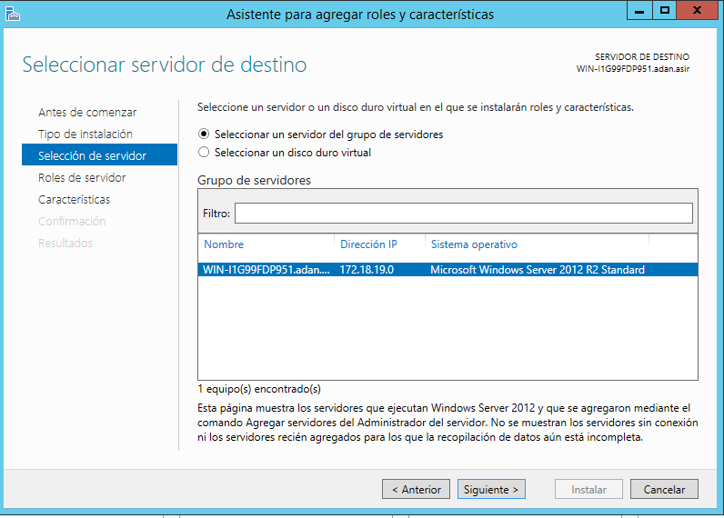

* Una vez aquí, buscamos el apartado llamado **Servidor DHCP** y lo seleccionamos, con lo que abriremos una nueva ventana en la que simplemente tendremos que darle a *Agregar características*.

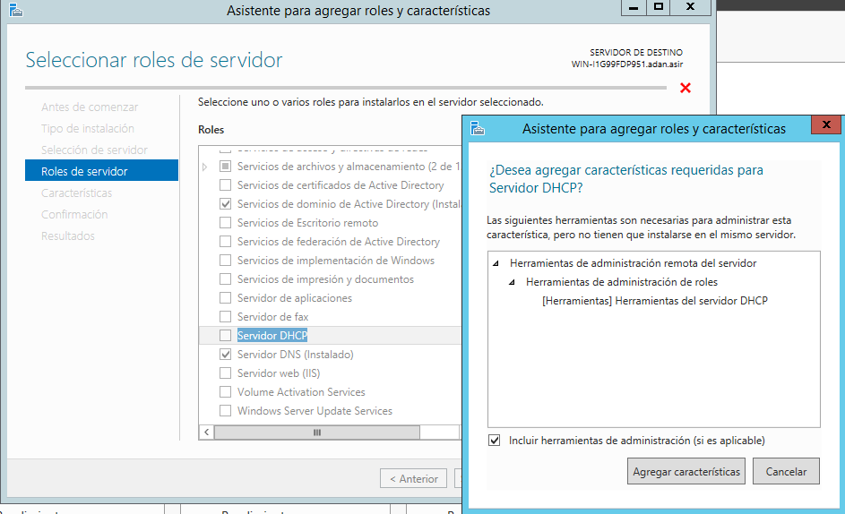

* En la siguiente ventana, pulsaremos *Siguiente* ya que no nos interesa cambiar ninguna característica más.

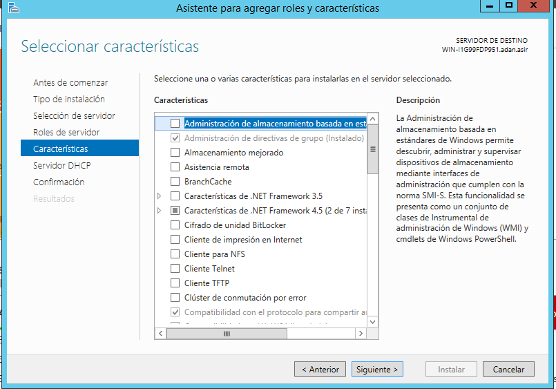

* Confirmamos la selección del servidor DHCP, con lo que procedemos a la instalación de éste.

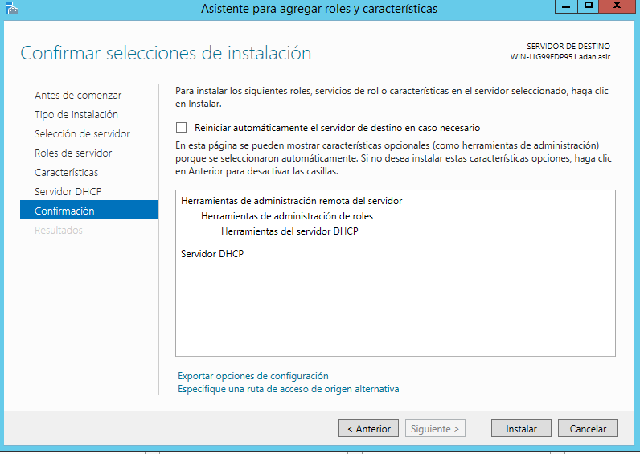

* Al finalizar, pincharemos sobre **Completar configuración de DHCP**, y completaremos los siguientes campos

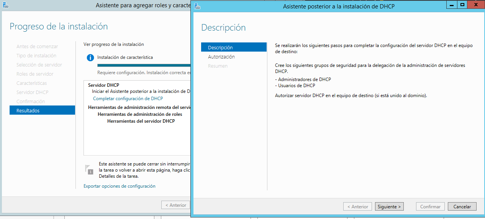

* En mi caso dejé las credenciales del usuario por defecto.

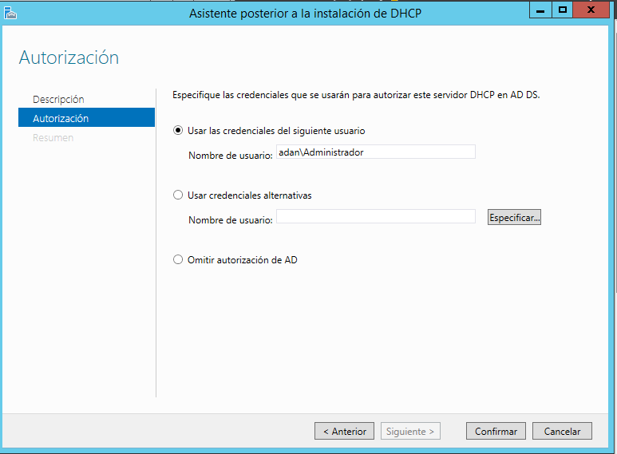

* Y ya tendríamos instalado el servidor DHCP como podemos comprobar en las herramientas.

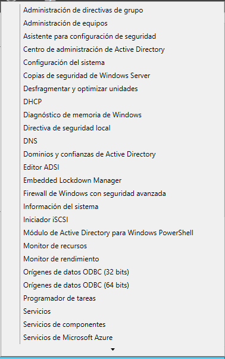

>Ahora tenemos que empezar con la configuración DHCP.

* En herramientas, vamos a DHCP, para proceder con dicha configuración sobre el servidor. Una vez ahí, vamos a crear un nuevo ámbito, en *IPv4*.

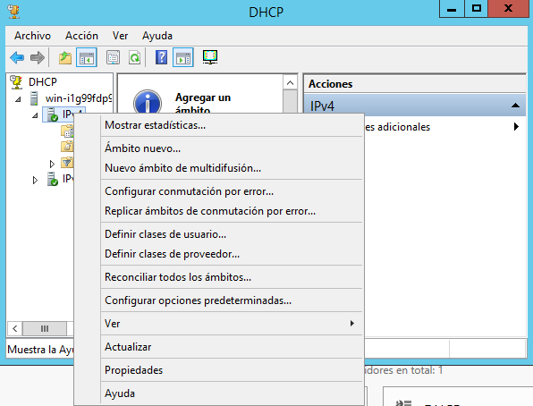

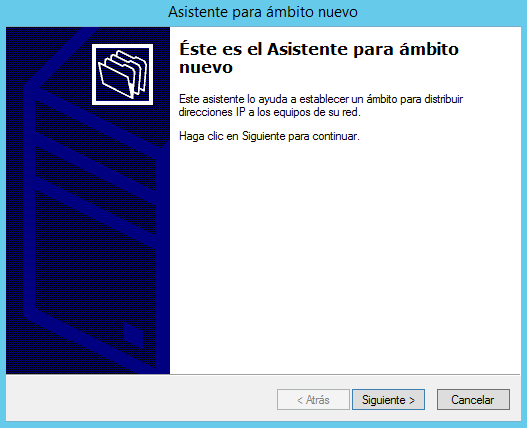

* El nombre de nuestro ámbito lo elegí aleatoriamente, igual que la descripción.

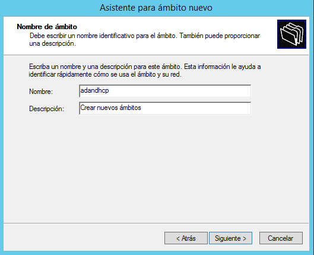

>Las IPs *172.18.19.0 y 172.18.19.1* están reservadas al servidor y puerta de enlace, respectivamente.
>
>Aún así tenemos que cogerlas para posteriormente excluirlas.

* En el rango de IPs, cogemos, por ejemplo, desde la IP del servidor hasta la *.25*  

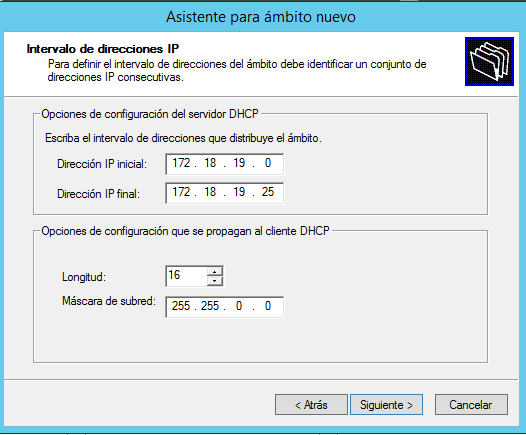

* Y ahora tenemos que excluir las dos IPs que ya están en uso, es decir, la del servidor y la del gateway.

* Seguimos, con siguiente, para finalizar la configuración.

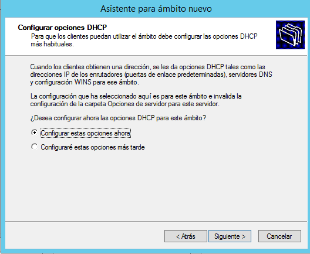

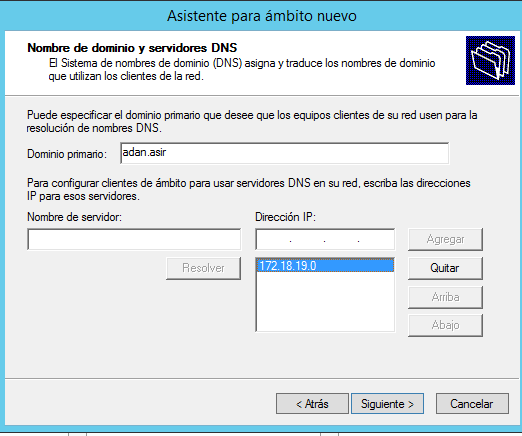

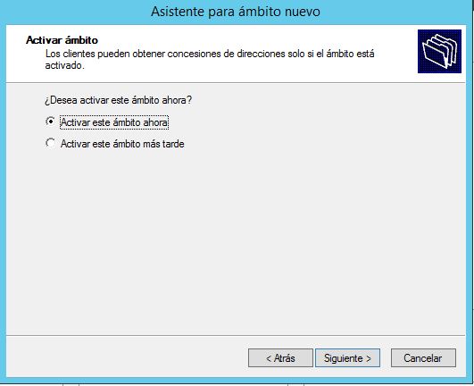

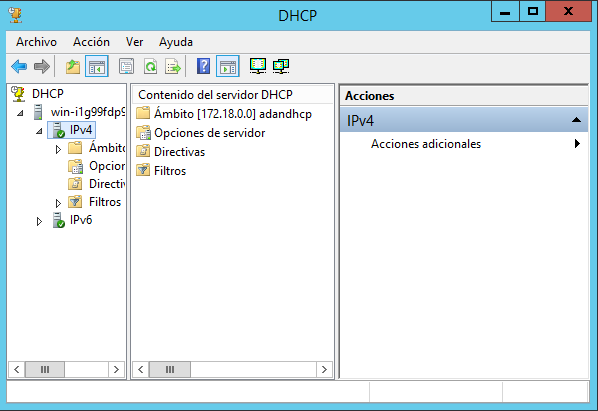

* Y ahora ya tendríamos la configuración del **servidor DHCP** terminada.

* En la máquina cliente tenemos que tener la IP del servidor como DNS preferido, *no olvidar*.

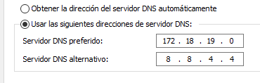

* En dicha máquina, renovamos la IP con el comando *ipconfig /renew*, y nos debería dar una IP asignada por el ámbito del servidor.

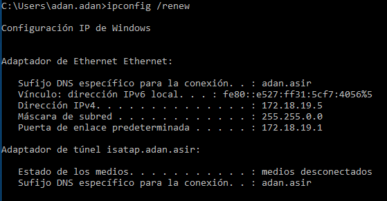

* Luego creamos otro Ámbito, pero con otras IPs, que en mi caso le di la 173.18.0.0

* Y para crear un **Superámbito**, con Click derecho sobre IPv4 > Superámbito, tenemos que darle un nombre y seleccionar los ámbitos que queremos tener dentro, que en nuestro caso elegiremos los dos creados.

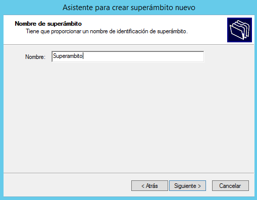

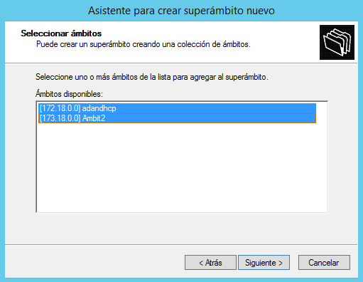

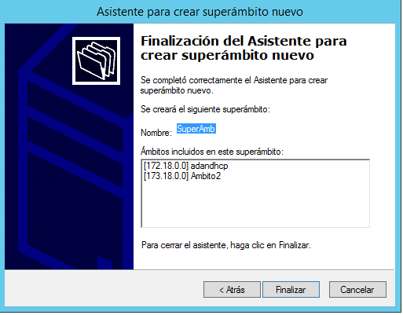

* Y nos tendría que aparecer lo siguiente, el segundo ámbito sale como desactivado porque lo hice yo manualmente.

* Si luego desactivamos el Superámbito, y vamos al cliente y renovamos la IP, debería salir un error, ya que ambos ámbitos no están activos, y son ellos los que nos proporcionan las IP.

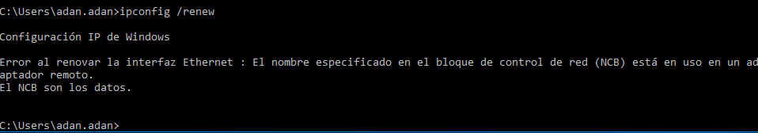

