# Servicio streaming. Práctica 1.

* Descargar e instalar IIS Media Services, soporte de Streaming para el Servidor web IIS.
Comprobar que aparecen, tanto a nivel de servidor como en los sitios web, las nuevas
opciones de Servicios Multimedia.

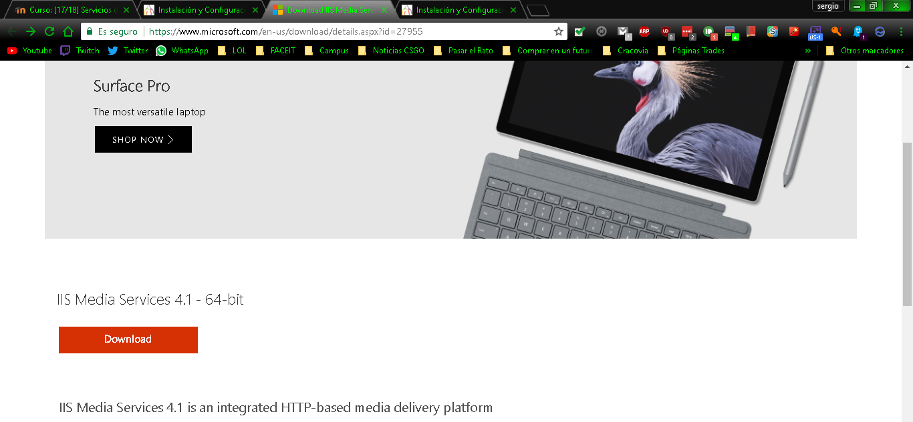

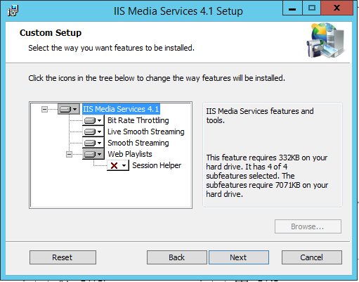

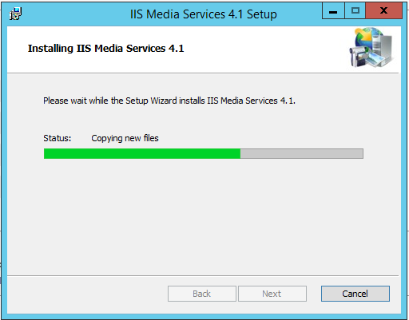

* Descargar   ejemplos   de   emisiones   multimedia   codificadas   para   su   emisión   en
streaming Windows Media Samples. Descomprimir sus contenidos en dos carpetas
independientes que nos servirán para su publicación en streaming.

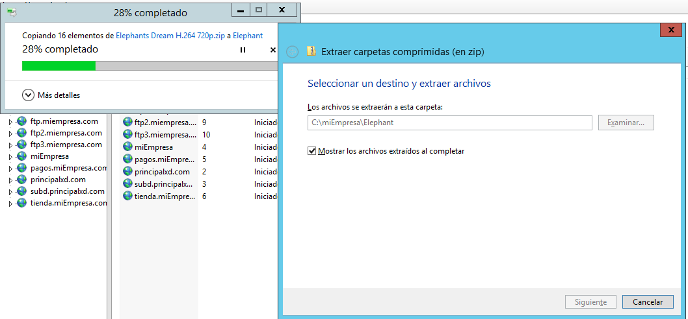

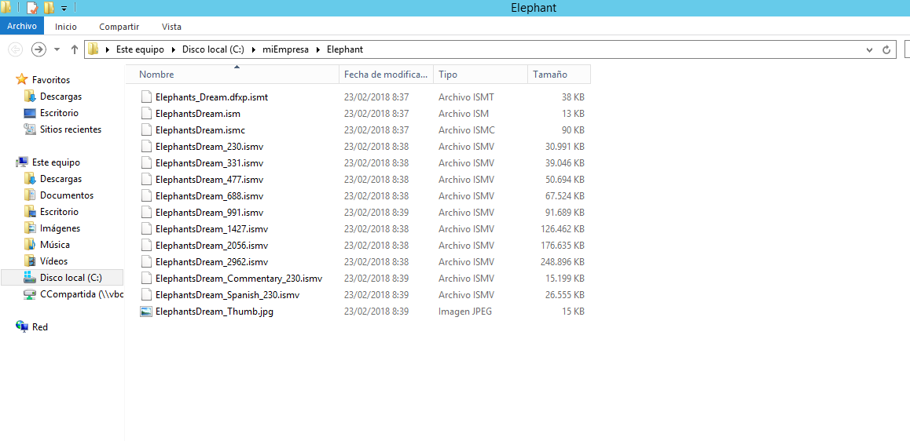

* Crear   dos   nuevos   sitios   web   asociados   a   los   contenidos   multimedia   descargados:
bunny.tudominio.ext y elephants.tudominio.ext. Crear previamente los registros DNS
asociados. Los sitios web deben ofrecerse a través de los enlaces descritos y apuntar
a las carpetas físicas donde alojamos los contenidos multimedia respectivos.

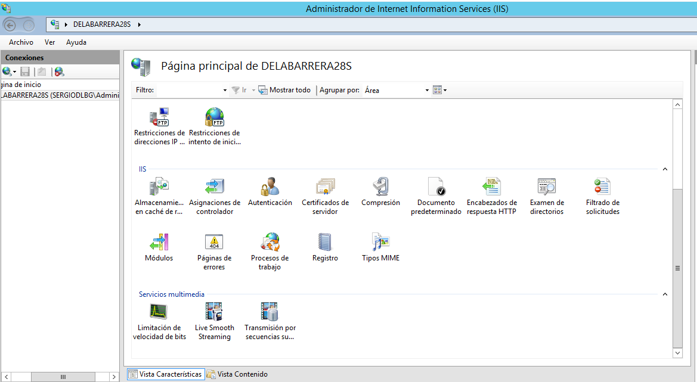

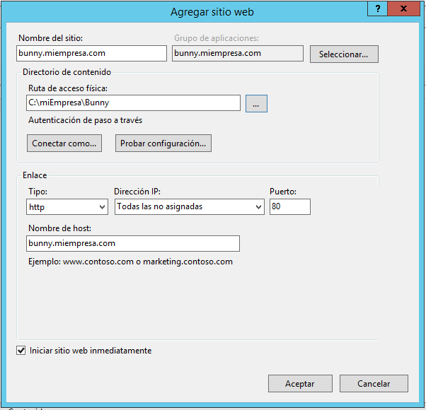

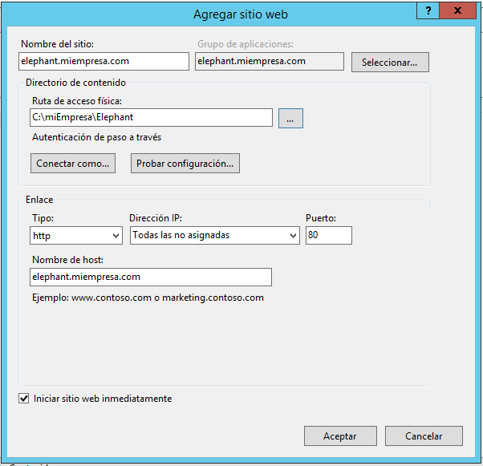

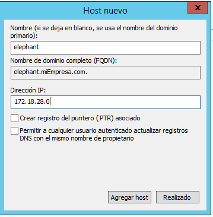

* Descargar y descomprimir el cliente de reproducción SmoothMediaPlayer. Copiar los
ficheros extraidos en las carpetas de los sitios web – streaming y editar el fichero
SmoothStreamingPlayer.html   para   adaptarlo   a   la   emisión   en   streaming   de   los
contenidos de cada sitio.

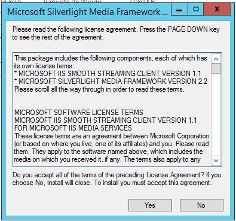

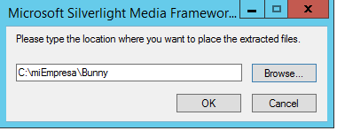

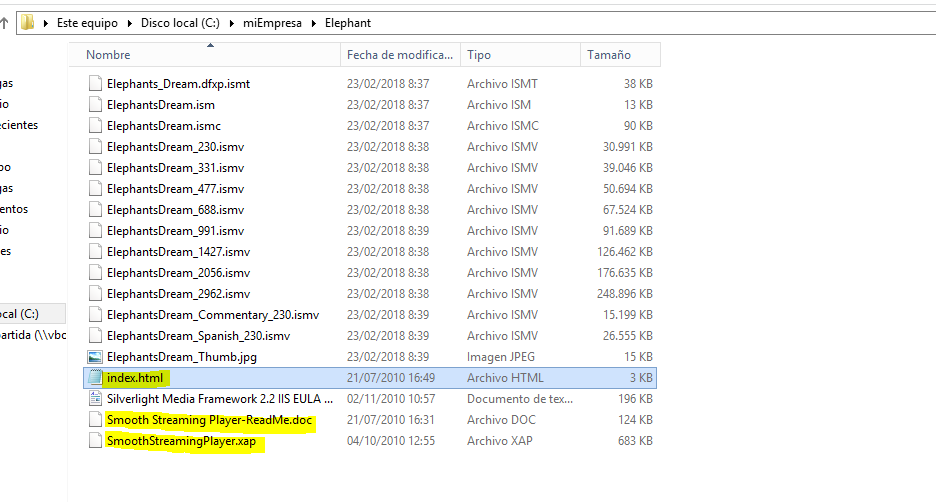

* Configurar ambos sitios web  para que accedan de forma predeterminada al archivo
html anterior.

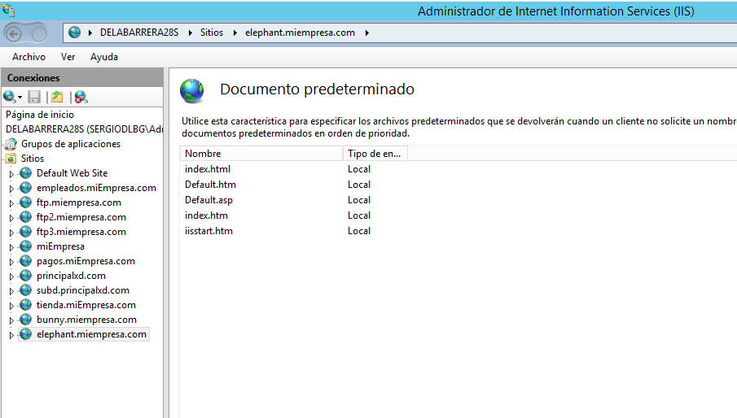

* Comprobar desde un navegador en el servidor la reproducción de ambos sitios.

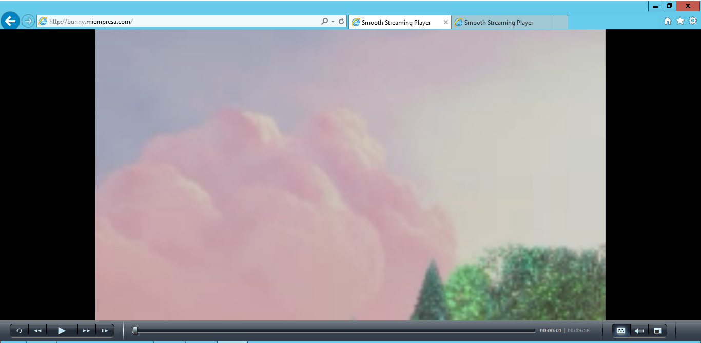

* Comprobar desde un navegador en una máquina cliente la reproducción de ambos
sitios.

* En las características de los Servicios Multimedia de uno de los sitios, examinar la
Limitación   de   Velocidad   de   Bits.   Incluir   un   comentario   sobre   su   significado   en   el
informe.

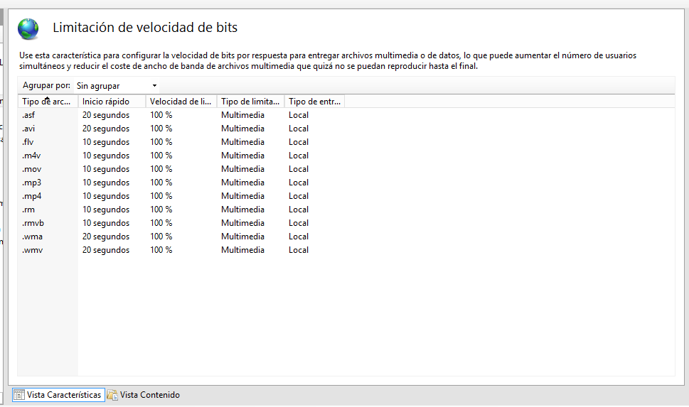

* Examinar también la característica de Presentaciones de Transmisión por Secuencia
Suave (Smooth Streaming) para comprobar el punto de acceso a la presentación y sus
contenidos (pistas de audio / video).

# Servidor streaming. Práctica 2.

* Descargar e instalar Microsoft Expression Encoder, para su correcta ejecución debes instalar
la Característica de Experiencia de Escritorio en tu servidor Windows 2012.

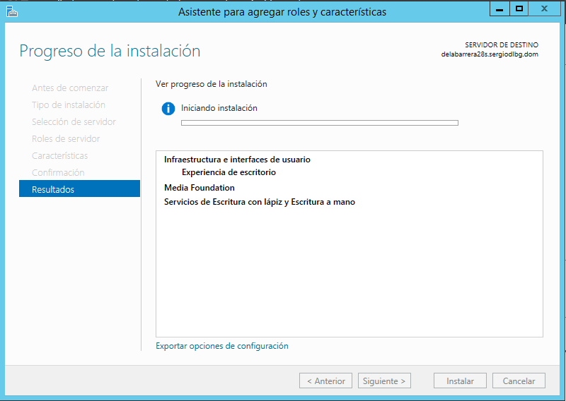

* Vamos a crear un nuevo sitio web en IIS para la emisión de una presentación multimedia en
Streaming pero, en este caso, se van a utilizar contenidos propios. Asi que, en primer lugar
debes contar con una serie de archivos de audio y/o video (formatos mp3, wma, avi, etc.).
  * A continuación creamos el sitios IIS (lo podemos llamar Playlist) que estaría asociado a un
registro DNS (playlist.tudominio.ext) y a una carpeta física (por ahora vacía) en cualquier
lugar de tu disco duro.

* En este momento, vamos a realizar la codificación de los archivos multimedia que hemos
elegido para que puedan emitirse en streaming (ten en cuenta que no se aceptan todos los
formatos). Para ello utilizaremos la aplicación Mircosoft Expression Encoder.

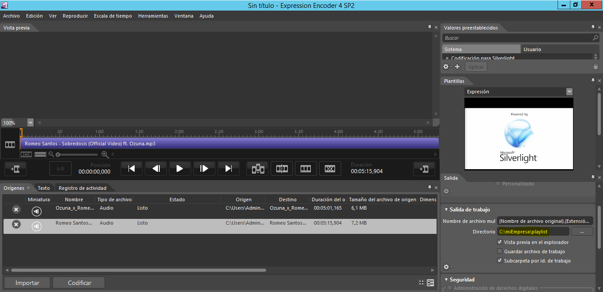

* Al Ejecutar el codificador (Encoder) seleccionaremos la opción Proyecto de Silverlight. Luego
añadiremos   los   archivos   que   nos   interesen   y   procederemos   a   codificarlos.   Antes
ajustaremos el directorio de salida de la codificación a la carpeta donde alojamos el sitio
web Playlist.
  * Ahora estableceremos como archivo predeterminado la página html que se ha creado en la
carpeta Playlist como punto de acceso a la presentación en streaming y reiniciaremos el sitio
web.

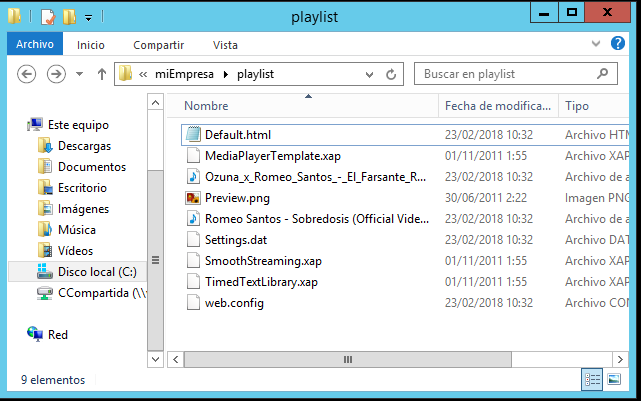

* Sólo nos queda comprobar en el servidor y en un cliente la correcta reproducción de
nuestro Playlist.

