# Práctica Servidor Web Apache - Linux - Pasos e indicaciones


---

* Configurar MV Ubuntu o similar en adaptador Puente (acceso a Internet)

---

* Apache:
  * Instalar Apache: sudo apt-get install apache2

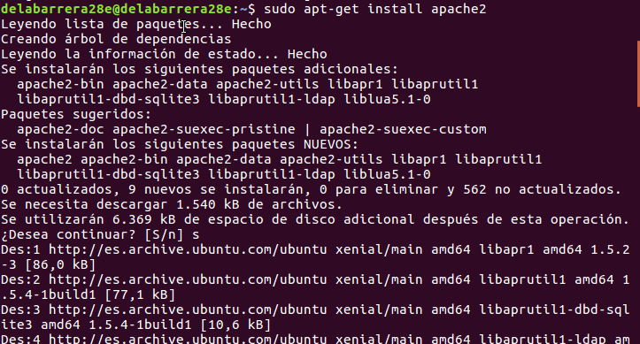

  * Comprobar carpeta raíz sitio web: /var/www


  * Comprobar acceso a localhost //It works!


  * Añadir línea www.miempresa.com asociada a IP servidor en /etc/hosts o servidor DNS. Comprobar acceso


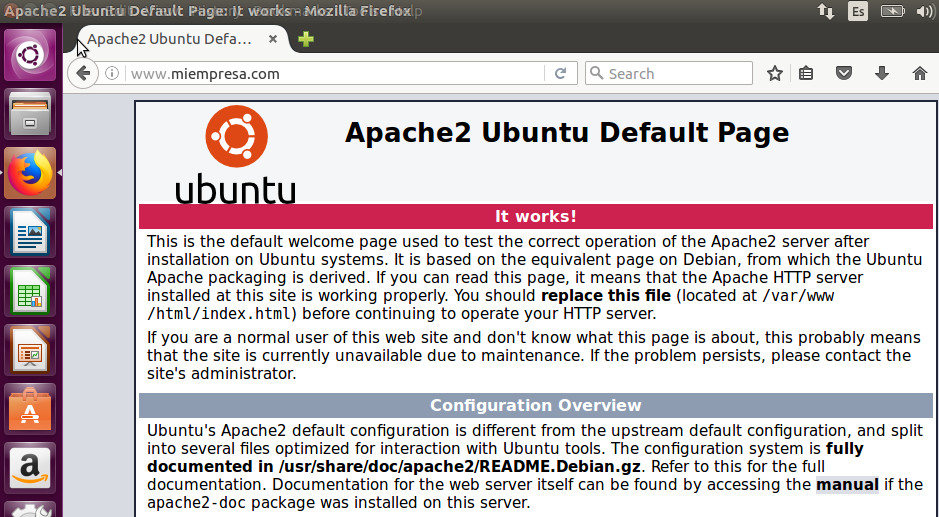

* Reiniciar apache: sudo /etc/init.d/apache2 restart ó reload

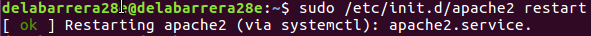

* Error + Access logs: /var/log/apache2


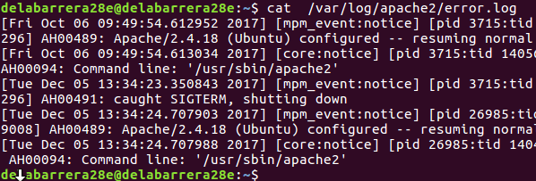

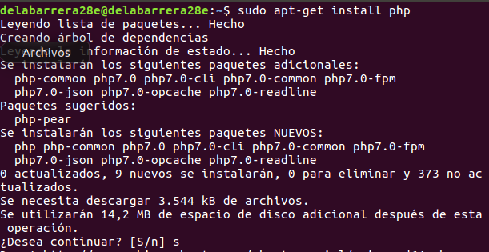

---


* PHP
  * Instalar php: sudo apt-get install php5


  * Comprobar acceso a index.php -<?php phpinfo(); ?>-

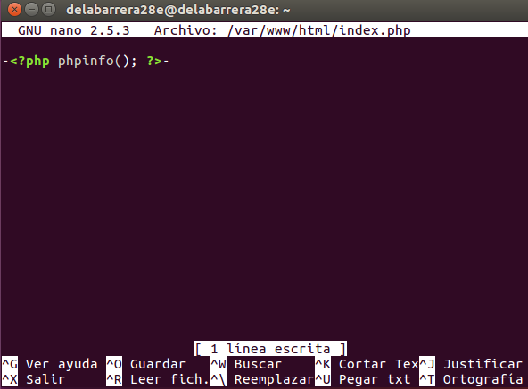

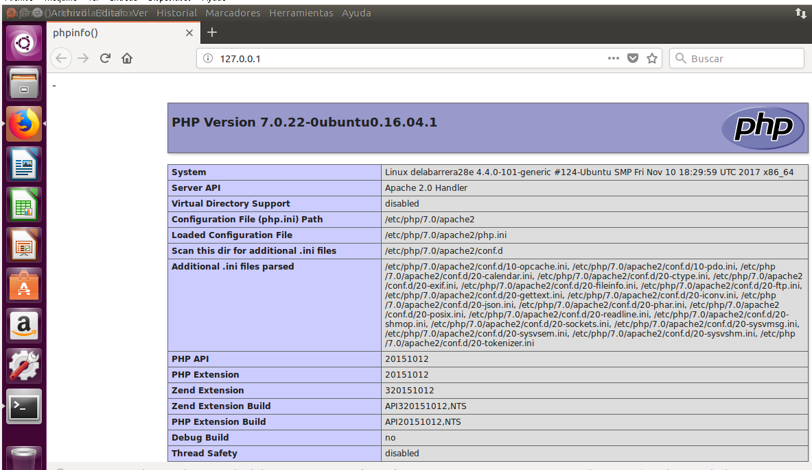

  * sudo apt-get install libapache2-mod-php5 //No debe ser necesario

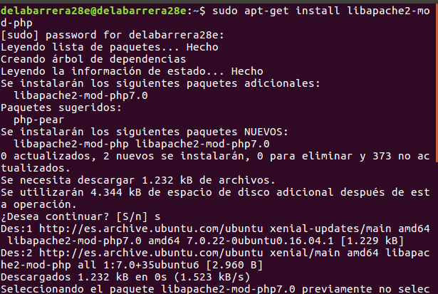

---


* Crear Hosts Virtuales en Apache, es decir, asociar carpetas con sitios web (ej: empleados.miempresa.com --> /var/www/empleados) y establecer configuración (/etc/apache2/sites-available/000-default.conf)

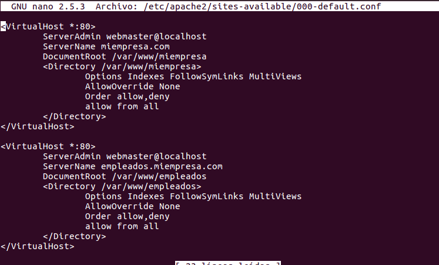

  * Configuración Hosts Virtuales (sitios web independientes) en este enlace:
    * Ejemplo:
```cmd
<VirtualHost *:80>

ServerAdmin webmaster@miempresa.com

ServerName empleados.miempresa.com //Añadir también a hosts o serviodor DNS

DocumentRoot /var/www/empleados

<Directory /var/www/empleados> // No es necesario para VirtualHost sencillos

Opciones típicas...

</Directory>

</VirtualHost>
```

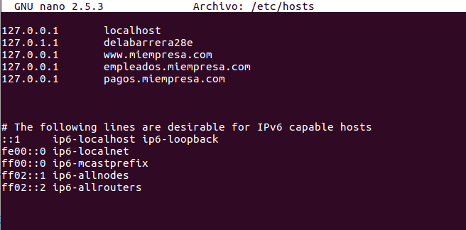


---

* Configurar sitio web seguro pagos:
  * Al instalar Apache, se instala también SSL
  * Generar certificado autofirmado:
      * § openssl genrsa -des3 -out server.key 1024

      * § openssl rsa -in server.key -out server.pem

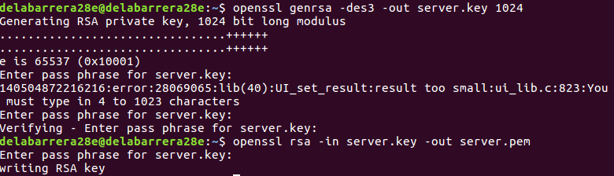

      * § openssl req -new -key server.key -out server.csr
      * § openssl x509 -req -days 360 -in server.csr -signkey server.key -out server.crt

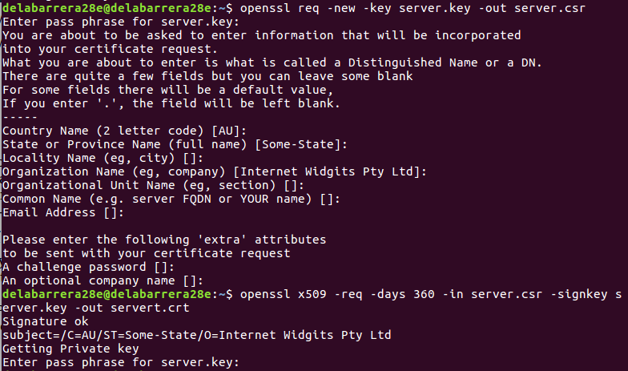

  * Modificar /etc/apache2/sites-available/000-default.conf según indicaciones PDF para crear host virtual seguro

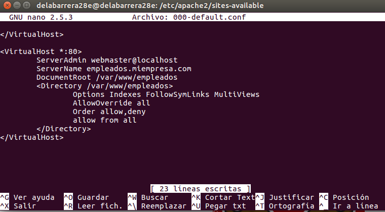

  * Habilitar módulo SSL apache: sudo a2enmod ssl

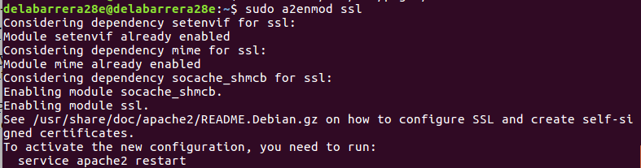

  ---

* Acceso a carpetas privadas


  * Autenticación mediante .htaccess: Ver enlace


---

No hemos podido continuar con la práctica debido a que la página no se muestra tal cual debería ser y no coge las configuraciones determinadas.

---
