# Instalación y Configuración  de un Servidor de Correo en Linux

Instalar servicio SMTP en Linux, utilizando el servidor Postfix:
* Descargar e instalar postfix: `apt-get install postfix`.

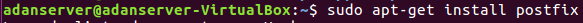
* Configuración de postfix:
* Escoger instalación como Sitio de Internet

* Crear dominio miempresa.com o similar

* Comprobar servicio (y puerto) SMTP activo y a la escucha con `netstat –utap`

* Realizar una prueba de envío de mensaje entre dos usuarios del sistema mediante
telnet, tal y como se indica en el ejemplo del apartado Prueba de Funcionamiento del
documento pdf.

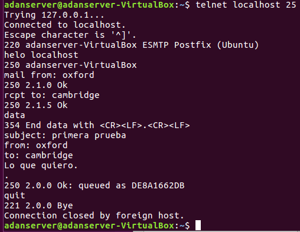

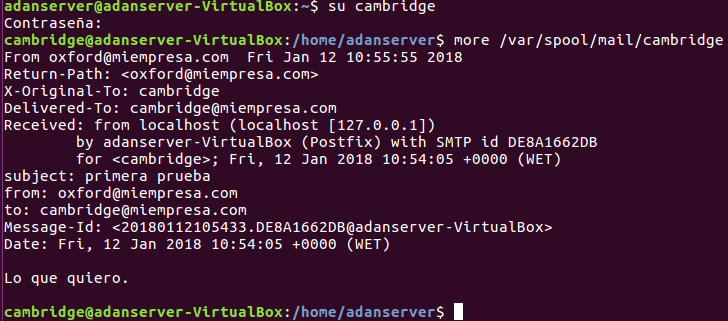
* Instalar un cliente de correo electrónico en un cliente (por ejemplo Evolution, para
Ubuntu).

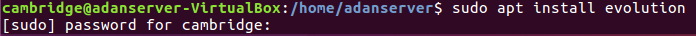

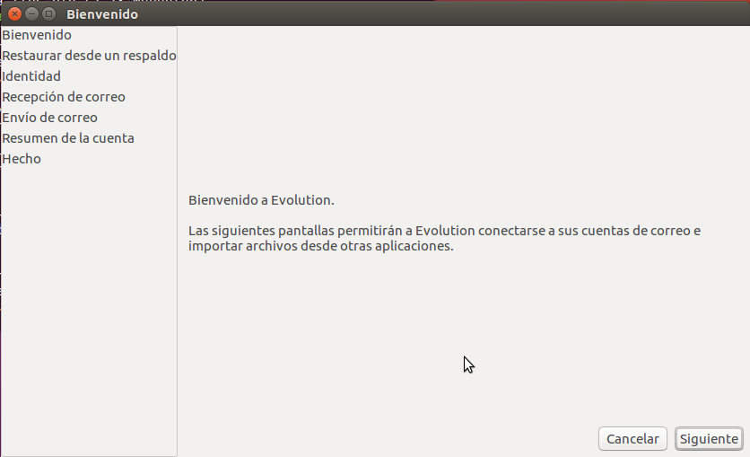

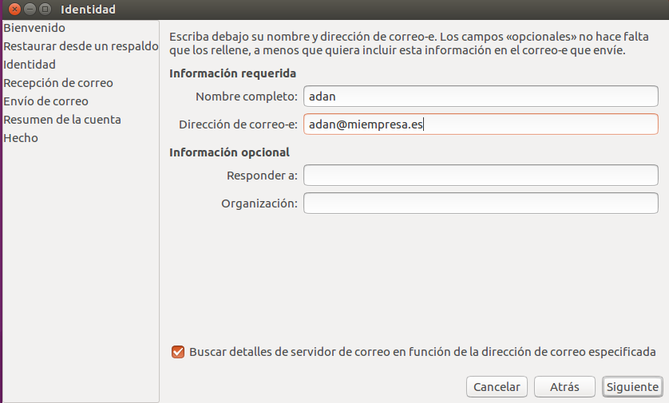

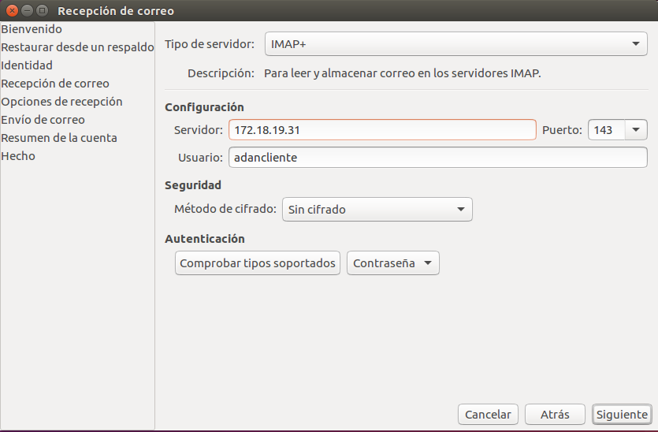

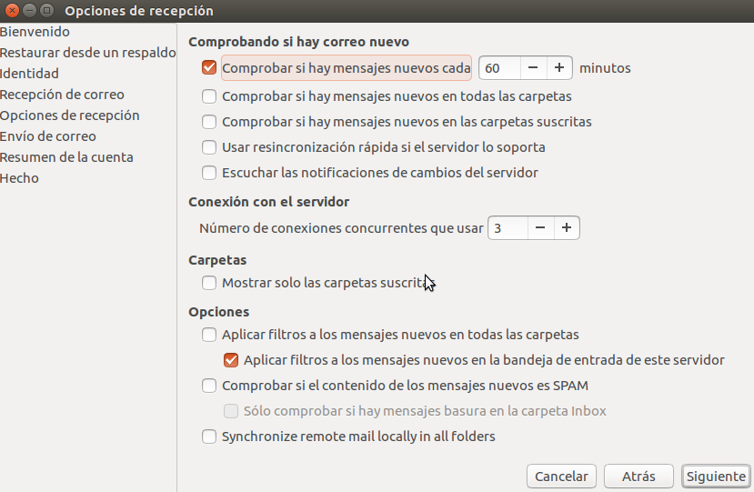

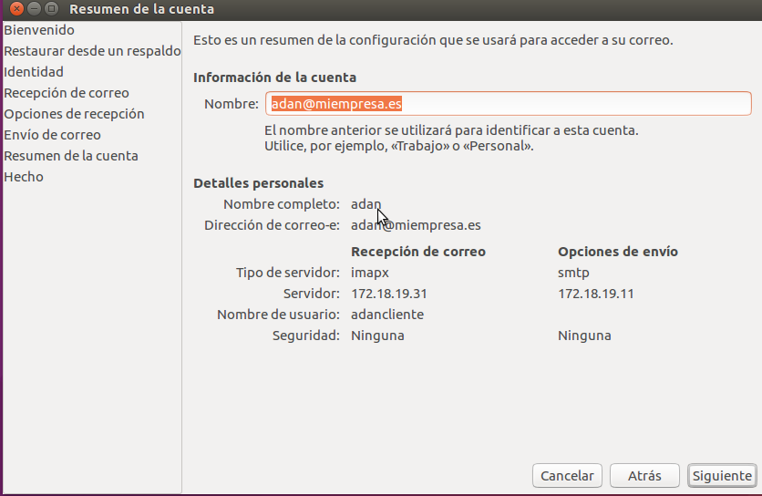
* Crear dos nuevas entradas en `/etc/hosts`: `smtp.miempresa.com` y `pop.miempresa.com`
asociadas a la IP del servidor.

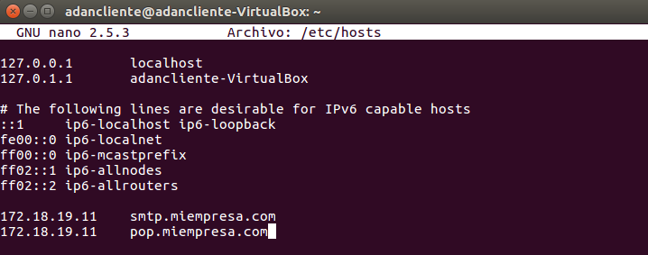
* Crear al menos dos cuentas asociadas a usuarios existentes en el servidor y asociadas al
dominio creado en Postfix. Configurar datos de las cuentas (dirección correo, servidores
entrante y saliente).

* Realizar envío de dos correos, uno con cada una de las cuentas creadas. Comprobar la
recepción de estos correos en el servidor examinando la carpeta `/var/mail`.

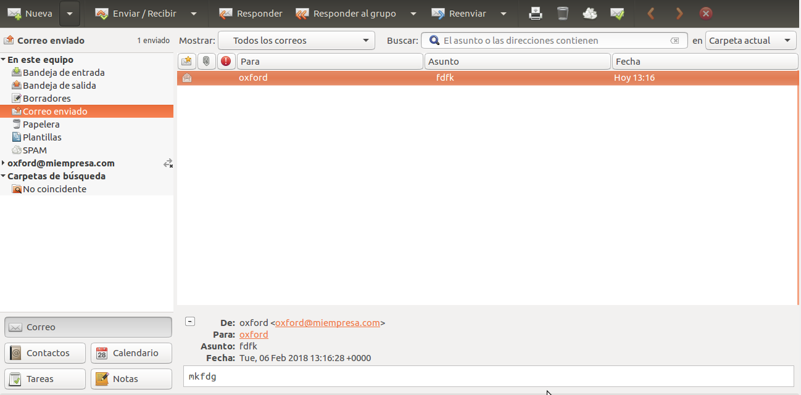

* Instalar servicio IMAP y servidor Correo Web SquirrelMail:
* Instalar servicio IMAP con `apt-get install dovecot-imapd`

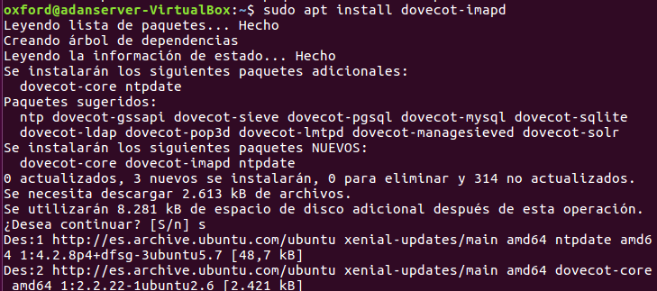
* Comprobar servicio (y puerto) IMAP activo y a la escucha con `netstat –utap`

* Instalar aplicación correo web SquirrelMail con `apt-get install squirrelmail`

* Carpeta de configuración en `/etc/squirrelmail`
* Carpeta de aplicación en `/usr/share/squirrelmail`
* Copiar lineas no comentadas `/etc/squirrelmail/apache.conf` en un nuevo fichero `.conf` de
`/etc/apache2/sites-available`, habilitar sitio y reiniciar apache

* Acceder vía HTTP en `/localhost/squirrelmail`

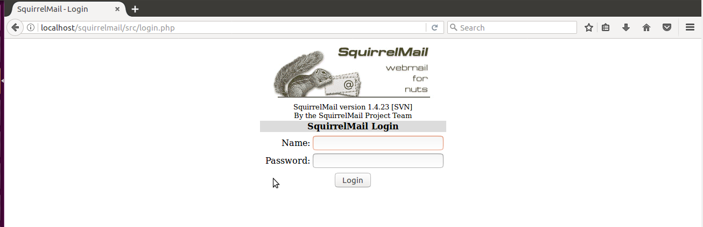

*  Acceder desde una máquina cliente, vía HTTP, al gestor de correo SquirrelMail instalado

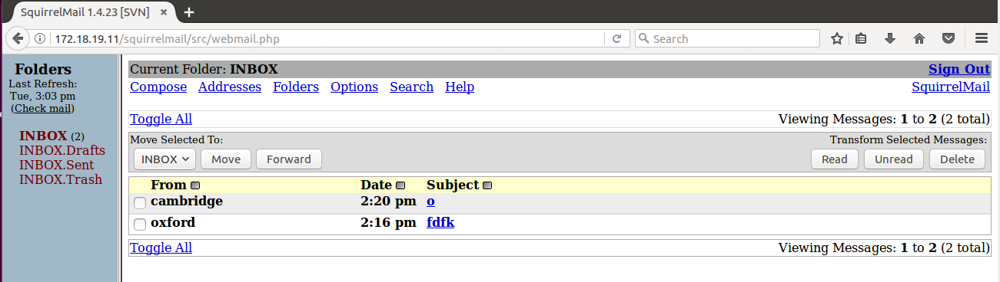
*  Enviar y recibir correos entre las dos cuentas creadas desde el cliente y utilizando el
gestor de correo web SquirrelMail

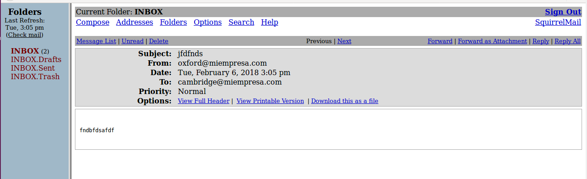

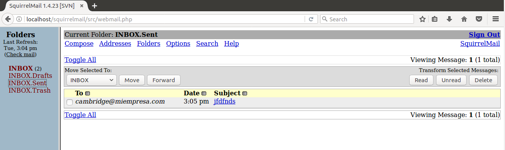

* Comprobar que los mensajes enviados desde ambas cuentas se siguen encontrando en
los respectivos buzones de los usuarios en `/var/mail`

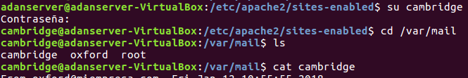

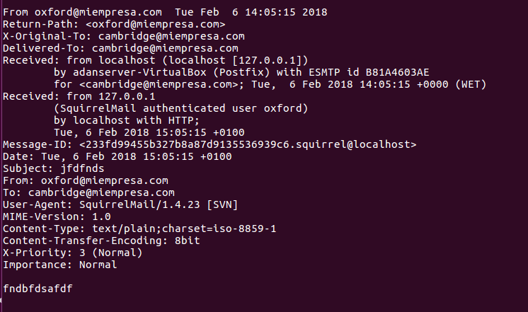
* Instalar servicio POP3:
* Instalar servicio POP3 con `apt-get install dovecot-pop3d`

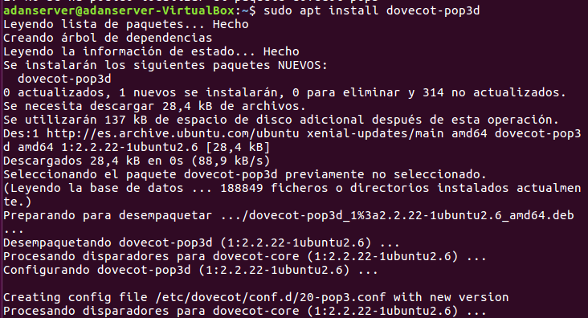
* Comprobar servicio (y puerto) POP3 activo y a la escucha con `netstat –utap`

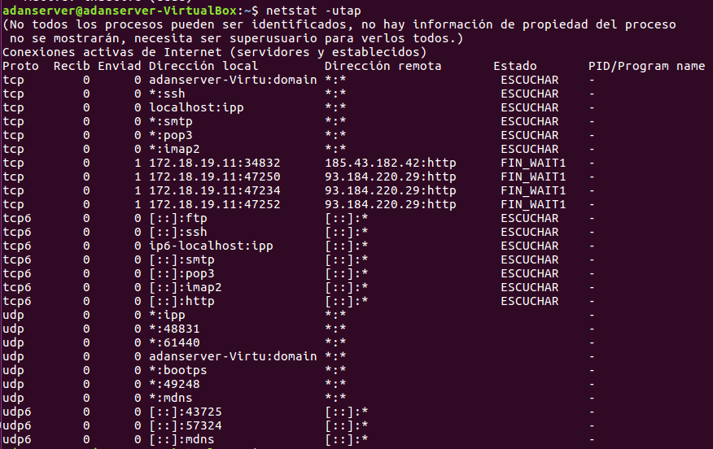
* Configurar MUA (gestor de correo cliente Evolution o similar) en máquina cliente para
que acceda a la recepción de correo a través del protocolo POP3 instalado en el
servidor.

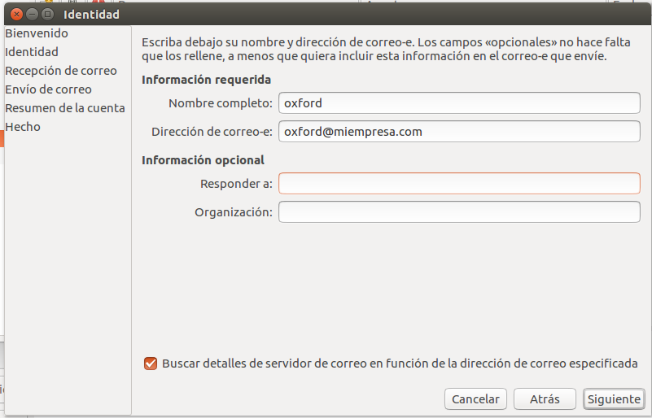

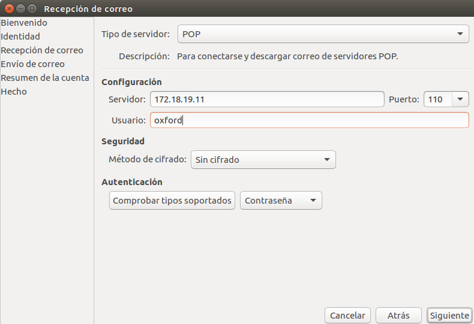

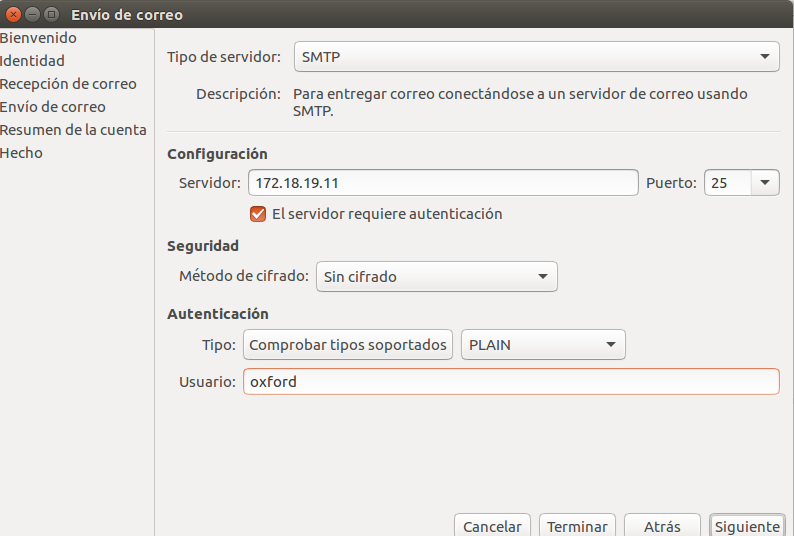

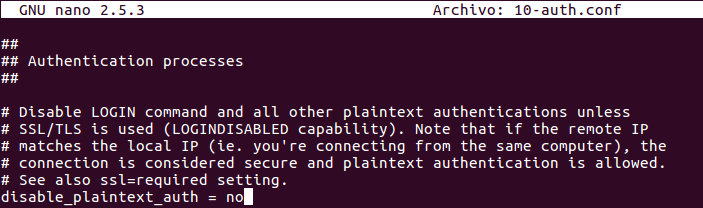

* Enviar y recibir correos entre las dos cuentas creadas desde el cliente y utilizando el
gestor de correo del cliente

* Comprobar que los correos enviados y recibidos han desaparecido (han sido extraídos
por POP3) de los buzones respectivos de los usuarios en `/var/mail`

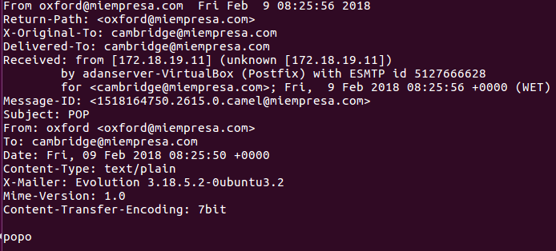

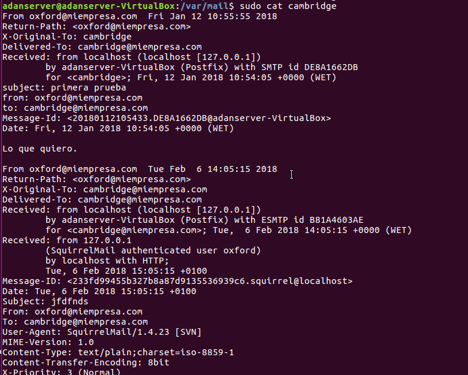
