# DNS Windows Server 2012.

---

* Con el servicio DNS activo, vamos a configurarlo para tener varios registros. Usaremos una máquina con Windows Server 2012 y un cliente con Windows 10.

* Creamos una nueva zona de búsqueda directa. `Administrador de DNS > Zonas de búsqueda directa > Nueva zona`

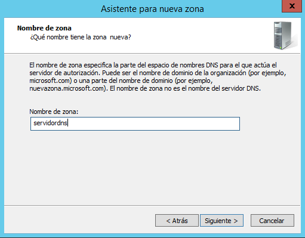

* En el asistente para la nueva zona, lo configuraremos a nuestra manera. Generalmente suele ser *Siguiente > Siguiente*.

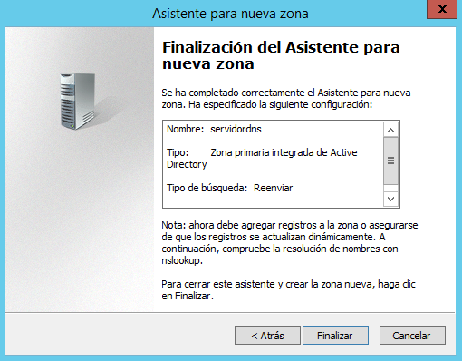

* Una vez terminado, al entrar en `Zonas de búsqueda directa` encontraremos nuestra nueva zona, en mi caso llamada **servidordns**.

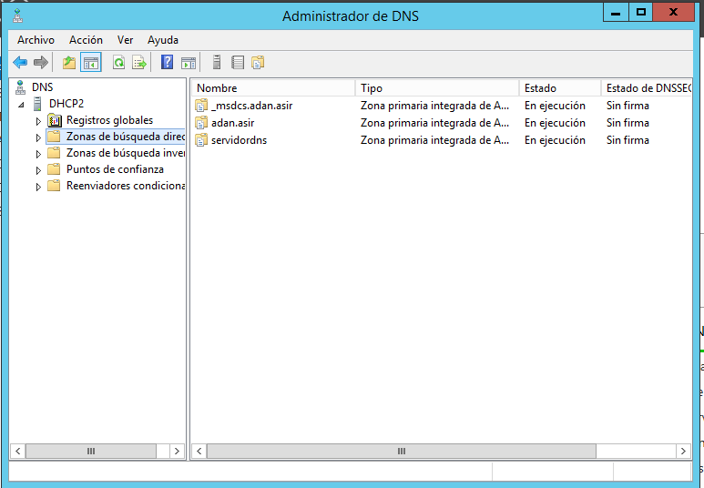

* Ahora haremos lo mismo, pero en **búsqueda inversa**. Crearemos la zona, y podremos nuestra IP donde pide la referencia con el servidor. `172.18.19`.

* Y comprobamos que se ha creado correctamente.

---

* Lo siguiente es configurar los **reenviadores** de DNS.
Vamos a nuestro `servidor DNS > Click derecho > Propiedades > Reenviadores` y ahí añadimos los reenviadores que queramos utilizar. En nuestro caso utilizamos unos proporcionados por el instituto.

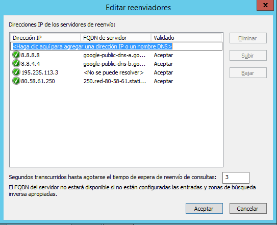

* Nos dirigimos al cliente, en servidor DNS ponemos la IP de nuestra máquina server y vamos a comprobar que funciona correctamente.

* Probamos en la `cmd` con un `nslookup www.google.es` por ejemplo, y vemos que lo recibe correctamente.

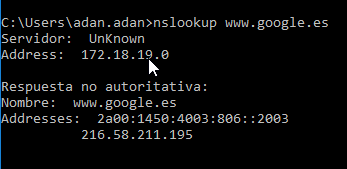

---

### Creación de hosts. DNS Maestro.

* Dentro de nuestra zona de búsqueda directa, llamada `servidordns`, vamos a crear nuevos hosts. Para ello, clickamos encima, elegimos `Host nuevo (A o AAAA)`. El primer host será nuestro propio servidor, así que lo llamaré igual que la zona de búsqueda, **servidordns**, con su respectiva IP.

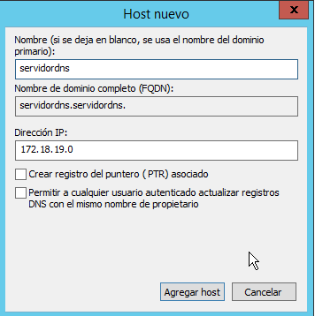

* Para crear un alias, vamos a *Hosts y alias (CNAME)* y elegimos nuestro host creado sobre el servidor, y en alias ponemos el nombre que nosotros queramos.

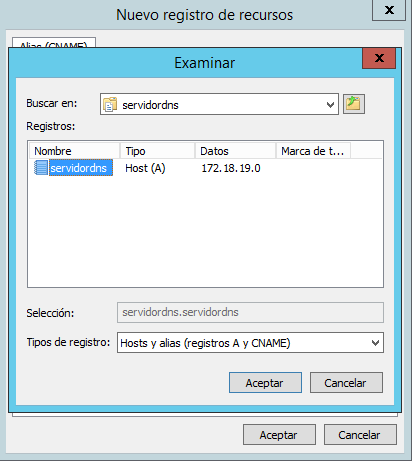

* Ahora crearemos una impresora, la cual tendrá una IP aleatoria, ya que en éste caso, es ficticia.

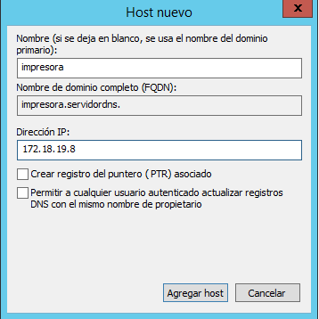

* Crearemos un servicio de correo, de la misma manera que creamos el host de la impresora.

* A este host de correo, le asignamos un servicio de correos, que lo asociaremos con nuestro servidor.

* Comprobamos en la `cmd` de nuestro servidor que podemos hacer un `nslookup` a cualquier host sin problema.

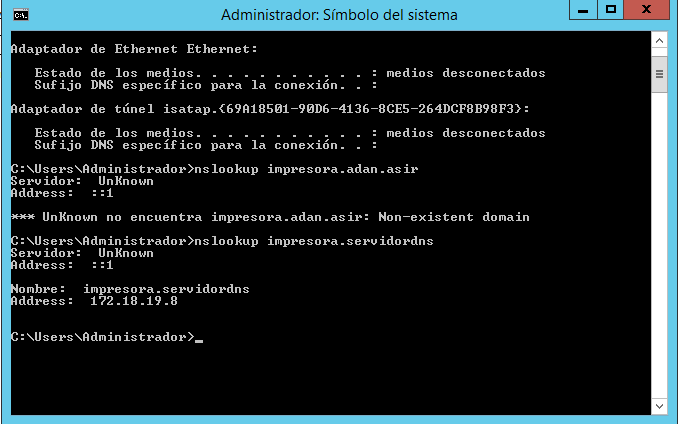

* Y lo comprobamos también en la máquina cliente.

---

### Creación de una subzona.

* A continuación creamos una subzona dentro de nuestra búsqueda directa. Es decir, dentro de ´servidordns´ creamos otro *dominio DNS*. Y su nombre será `servicios`.

* Dentro de dicha subzona, crearemos también varios hosts, entre ellos, un servidor ftp, con una IP aleatoria.

* Creamos también un host para una nueva impresora.

* Y un host para el ordenador del administrador.

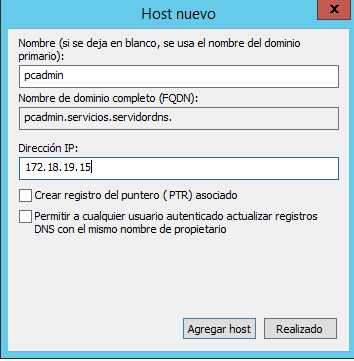

* Vamos a la `cmd` y probamos que resuelve cualquiera de los hosts dentro de la *subzona 'servicios'*

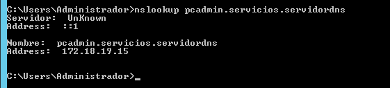

* Si con cualquier cliente, nos conectamos dentro del dominio del servidor, vemos como aparece su registro dentro de la zona de búsqueda del server, nuestro cliente es `DESKTOP-5U25GFM` y ahí aparece.

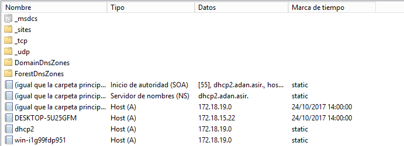

---

### Comprobaciones finales.

* Comprobamos desde la máquina cliente que aparecen todos los hosts creados con un `nslookup`, y que además, haciendo una llamada por ejemplo a google, también la efectúa.

---
