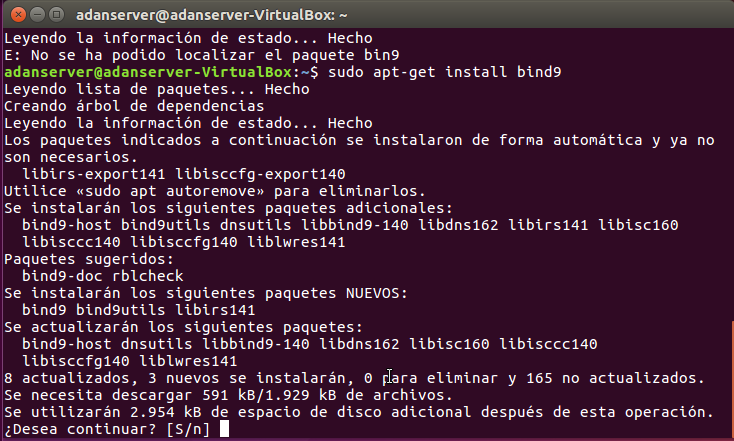
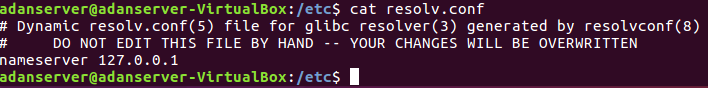
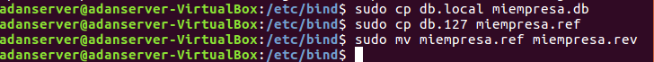
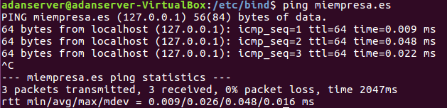
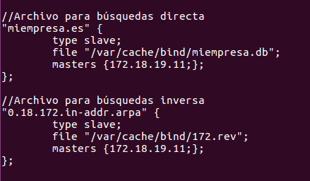
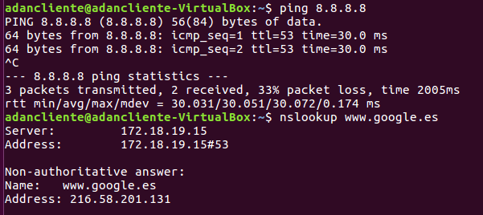

# DNS Linux.

---

* Instalamos el servicio `bind9`

* Configuramos el archivo `resolv.conf` para que el servidor DNS sea la misma máquina.

* Configuramos el servidor como *caché DNS* con los reenviadores de DNS públicos.

* Configuramos el DNS como maestro, añadiendo una empresa virtual llamada *miempresa.es* y añadimos una zona de búsqueda inversa y directa.

---

* En la máquina cliente, configuramos la IP con su respectiva dirección que nosotros le asignaremos, y a continuación pondremos en su servidor DNS la IP de nuestro servidor.

* Comprobamos que todo va correctamente con un nmap a *www.google.es* y con un ping al mismo host.

* Creamos los archivos de búsqueda directa e inversa de nuestra empresa, para ellos clonamos los que ya teníamos y a continuación los actualizamos.

* En el de búsqueda direta, rellenamos los datos con `miempresa.db` y añadimos el host del propio cliente.

* Y ahora vamos al archivo de búsqueda inversa para configurarlo, en el cual pondremos la IP de la *máquina servidor.*

* Comprobamos que no hay ningún fallo desde el servidor.

* Comprobamos que no hay ningún fallo desde el cliente.

---

* Vamos a clonar la máquina servidor para tener una máquina que haga el funcionamiento como **esclavo**.

* Modificamos los archivos de búsquedas para ponerlos de tipo `esclavo` y añadimos el *master*, que en este caso es la máquina **servidor**.

* Creamos los ficheros de búsqueda pero los dejamos en blanco, ya que esta máquina buscará la información en el servidor.

* Por último comprobamos desde el cliente que funciona la conexión a través de **ping y nslookup**.

> Antes debemos parar el servicio con `/etc/init.d/bind9 stop` en la máquina servidor, y comprobar que en la máquina esclava está activo.

---
