# Instalación y Configuración del Servicio FTP en Windows 2012 Server

* Instalar Servicio FTP en Windows 2012 Server, a través de Agregar roles y características (IIS)

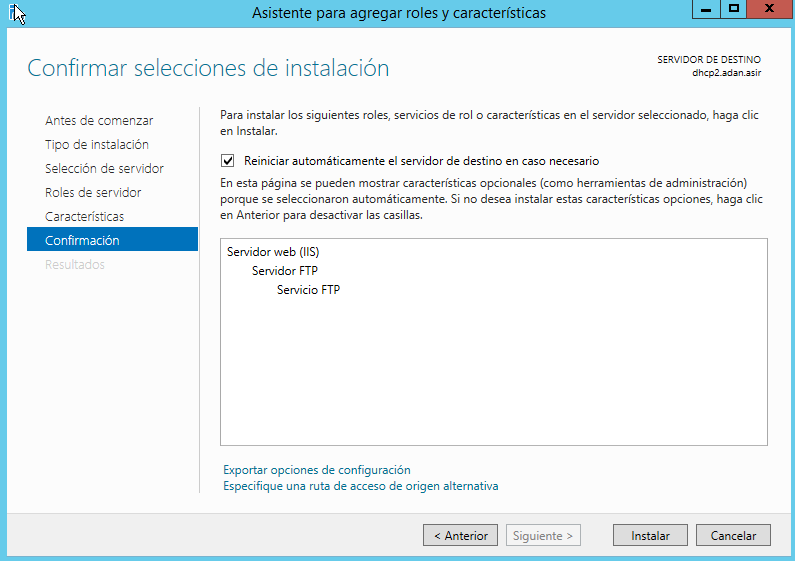

* Acceder a la creación y configuración de Sitios FTP por medio de la Administración de IIS.

---

 Crear tres nuevos sitios FTP (en todos ellos se debe poder acceder a través de las IPs del servidor y, en algún caso, de un nombre DNS ftp.tudominio.ext):

  * Uno asociado a la unidad C: completa. No debe permitir accesos anónimos. Sin uso de SSL. Sólo el usuario Administrador podrá acceder al sitio. Modos lectura y escritura.  Ahora realiza las siguientes acciones:
  

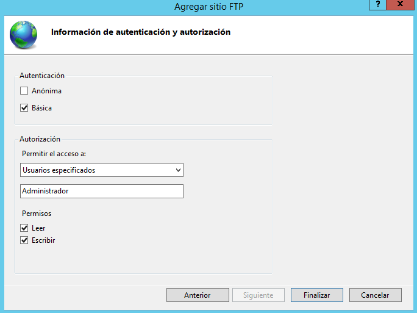

    *  Examina todas las opciones de configuración de la página principal de tu Sitio FTP (IIS) y haz una descripción breve de cada una en el informe. No modifiques nada aún.
    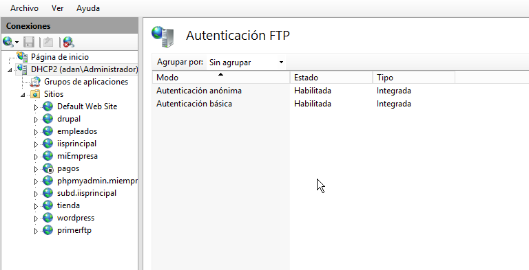
      *  Trata de acceder al sitio ftp desde el propio servidor a través de un navegador y un explorador de archivos.
      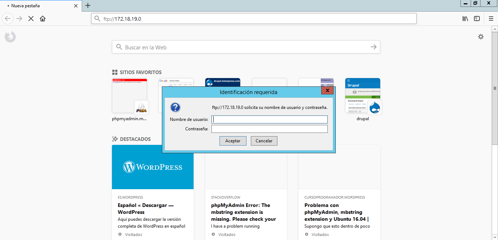
      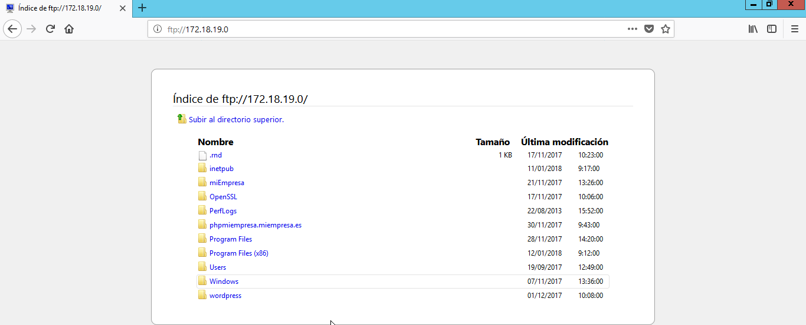
      *  Comprueba accesos permitidos y denegados. Comprueba también permisos asignados.
      *  Accede ahora desde un cliente Windows de la misma forma. Realiza comprobaciones.
      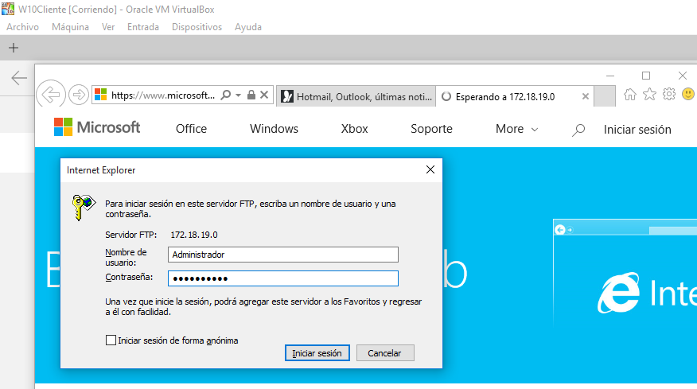
      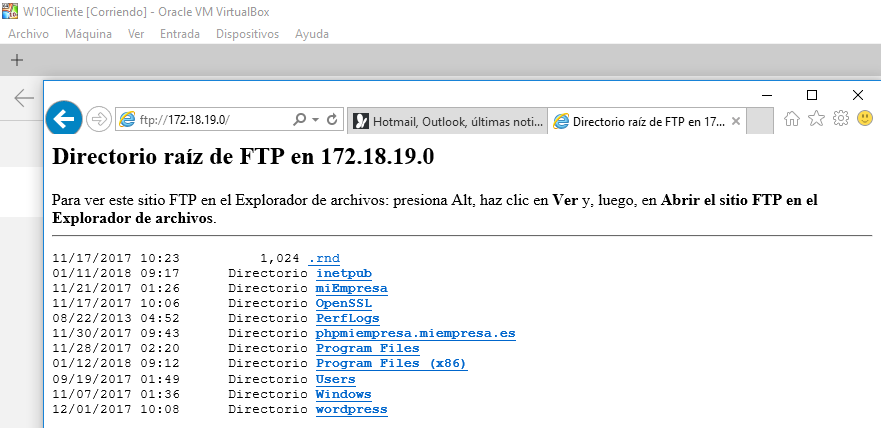
      *  Instala el software WinSCP en el cliente Windows, configura la conexión a tu sitio ftp y trata de establecer conexión y realizar comprobaciones.
      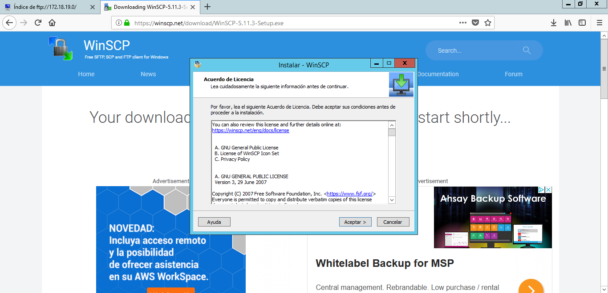
      
      

  *  El segundo asociado al directorio wwwroot de Inetpub. Se permitirá el acceso a todos los usuarios de Active Directory en modo lectura y escritura. No permitimos acceso anónimo y habilitamos en este caso la posibilidad (permitir, no requerir) de conexiones SSL asociadas a uno de los certificados que poseas en IIS. Realizar diferentes comprobaciones válidas e inválidas de conexión y operaciones, tanto desde el servidor como desde el cliente. Realizar una configuración de conexión SSL desde WinSCP.
  
  
  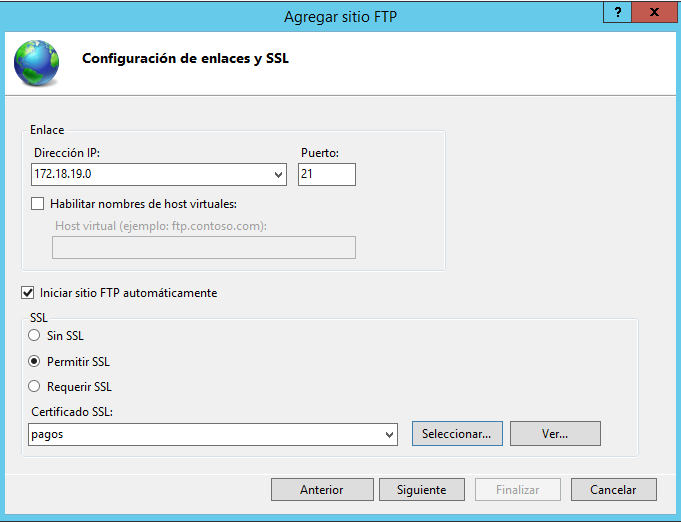
  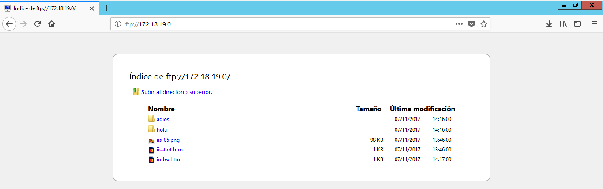
  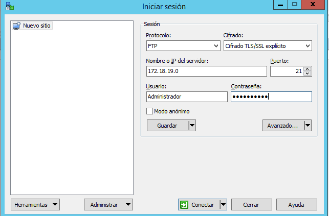
  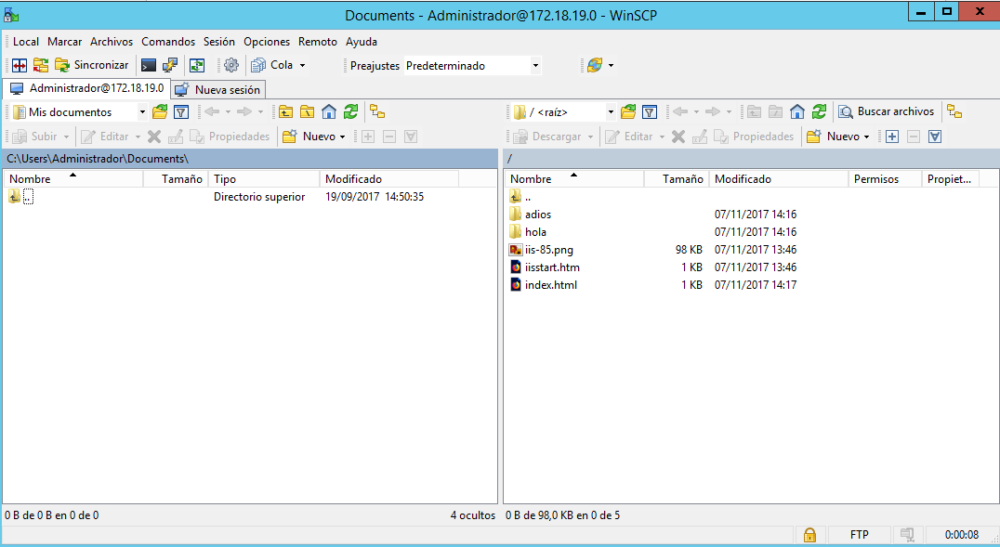

  *  El tercer sitio FTP debe asociarse a una carpeta cualquiera del servidor que contenga información (archivos y carpetas), pero que no sea importante. Permitiremos acceso anónimo y sólo se podrá consultar y leer. Comprobar desde servidor y cliente.

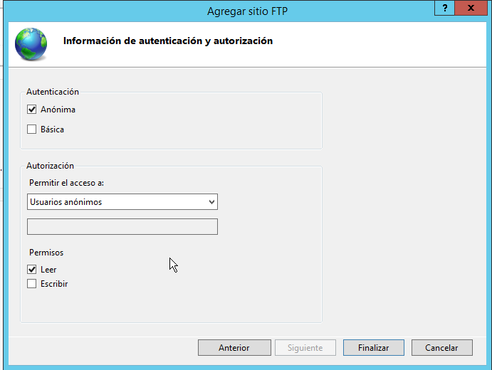

---

* Se debe crear un nuevo registro DNS que permita acceder a nuestro sitio FTP a través de la dirección ftp.miServer.com (o el dominio que utilices habitualmente).
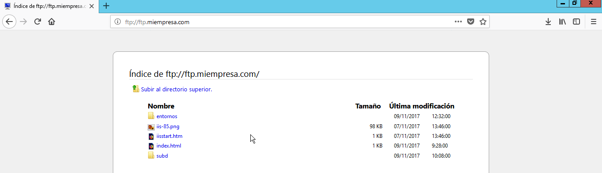
* En un principio es posible que debas detener un sitio web para que pueda iniciarse otro. Tras comprobar el funcionamiento por separado de los sitios, encontrar una solución para que nuestro servidor ofrezca varios sitios FTP simultáneamente.
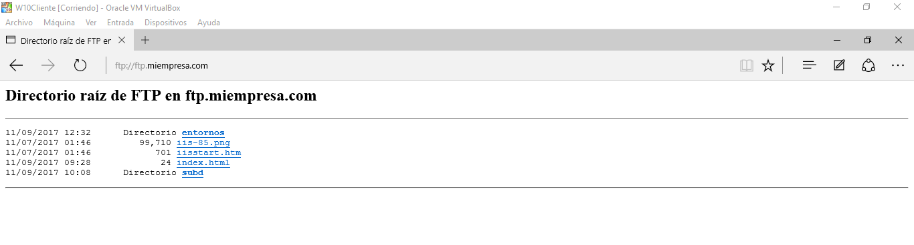

---

# Instalación y Configuración del Servicio FTP en Ubuntu

* Instalar Servicio SSH en el servidor Linux.

* Crear dos usuarios en el sistema, con diferentes privilegios y niveles de acceso al filesystem.

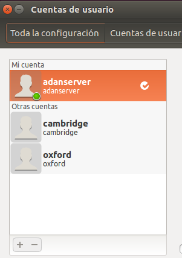

* Comprobar, desde una máquina cliente, acceso de los usuarios mediante ssh.

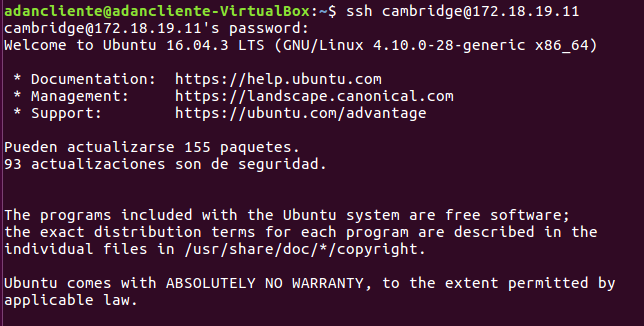

* Tratar de ejecutar una aplicación gráfica del servidor de forma remota, desde el cliente, mediante ssh.

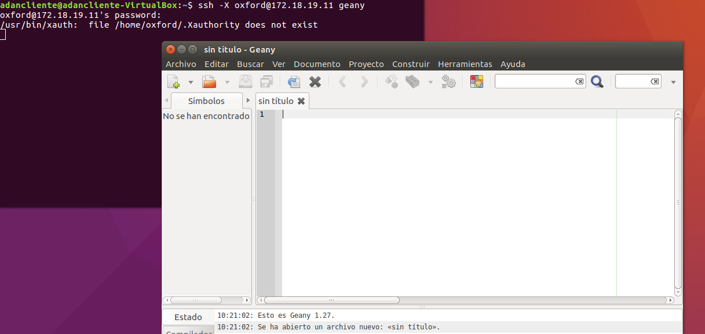

* Acceder, también desde el cliente, mediante sftp (ftp seguro, incluido en el paquete ssh) al sistema de ficheros del servidor y probar acceso, carga y descarga de archivos con ambos usuarios.

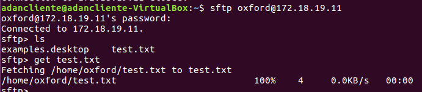

* Realizar varias copias de archivos hacia / desde el servidor mediante scp, utilizando también los dos usuarios creados anteriormente.

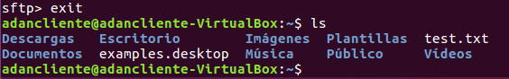

* Instalar el paquete proftpd.

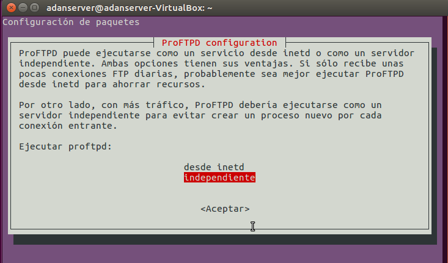

* Investigar y editar el fichero de configuración /etc/proftpd/proftpd.conf buscando información en Internet.

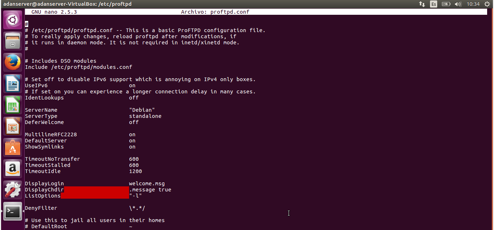

* Tratar de conectar al servicio ftp gestionado por proftpd tanto desde el servidor como desde un cliente.

* Desde la máquina cliente, probar el acceso al ftp mediante los usuarios creados y realizando diferentes operaciones de listado, subida y descarga de archivos.

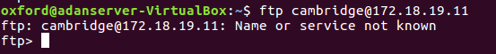

---
