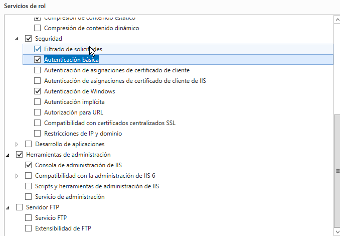
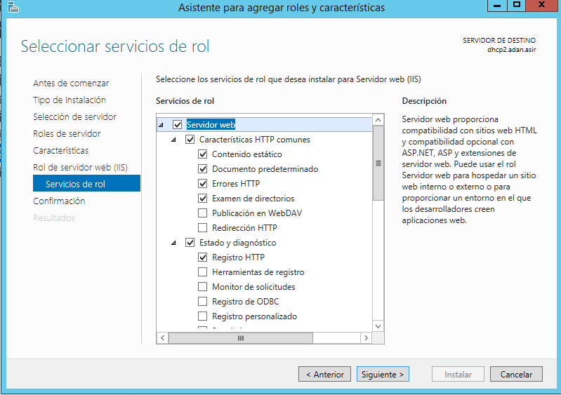
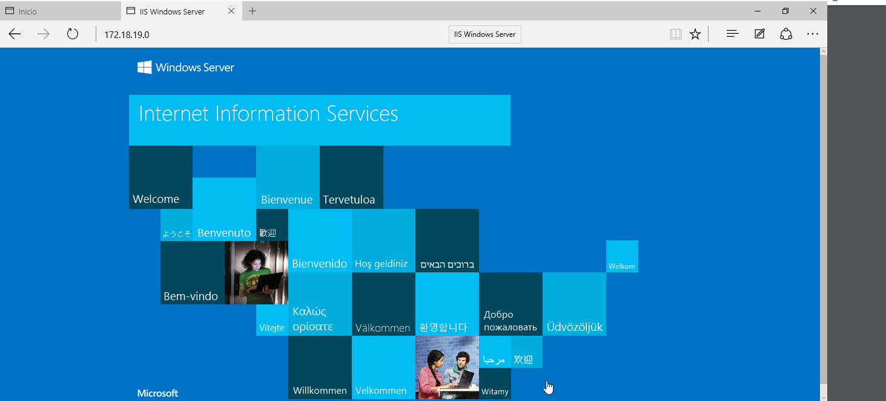
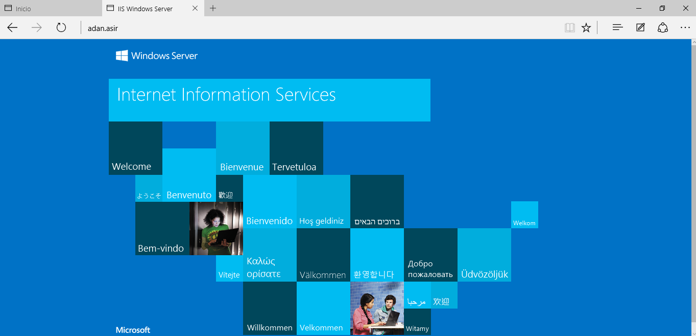
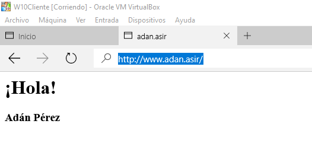
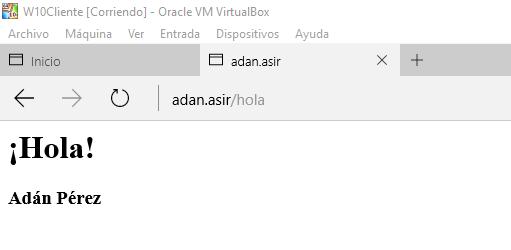
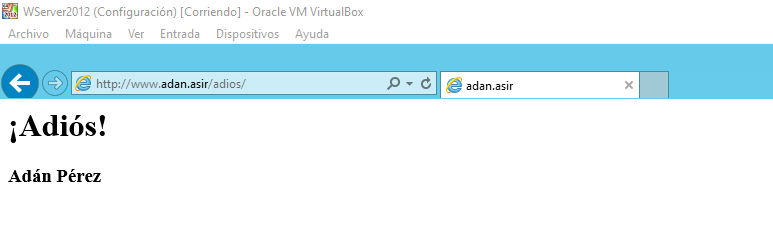
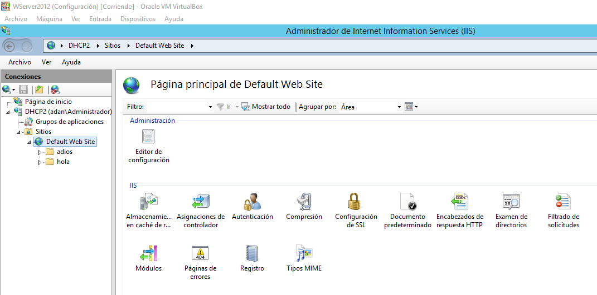
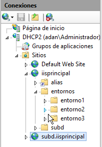
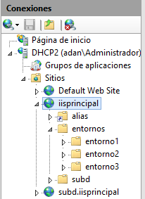

# IIS Windows 2012 Server I.

---

* En primer lugar, en una máquina Windows Server 2012 instalada, también con DNS instalado, vamos a instalar el servicio IIS.
  * Para ello nos dirigimos a `Agregar roles y características`.

* Elegimos la opción `Servidor web (IIS)`.

* En roles, tenemos que marcar la casilla de `Autenticación Windows y Autenticación Básica`.

* Comprobamos que la vamos a instalar correctamente.

* Y esperamos en lo que se realiza la instalación.

* Ya tenemos el servicio IIS instalado, lo siguiente será abrir un navegador para comprobar que nuestra página web funciona correctamente a la vez que el servicio.
  * Escribimos en la barra de búsqueda `http://172.18.19.0` que es la IP de mi máquina y nos debería dirigir a la siguiente página.

* Comprobamos de la misma forma en la máquina cliente. No olvidar que el servidor DNS de nuestro cliente debe ser la máquina servidor.

* Ahora nos volvemos al servidor, vamos a `Herramientas -> DNS` y en nuestro dominio, vamos a crear un Host A que lleve la IP del servidor, y luego un alias para utilizar *www* que enlace el propio servidor.

* Hecho esto, en la misma máquina comprobamos desde un navegador utilizando `http://adan.asir` (nombre de mi dominio DNS), nos debería dirigir a la misma página web anterior.
  * Ésto lo comprobamos en la máquina servidor, y también utilizamos `http://www.adan.asir` para utilizar el CNAME.
  * Y repetimos ambas comprobaciones desde la máquina cliente.
  * Si queremos que nuestra página muestre algún contenido, deberemos ir a `Disco local C: -> inetpub -> wwwroot` y crear un **index.html** con el contenido que queremos mostrar. Esta ruta es la ruta por defecto del primer website.
  * En la misma ruta, crearemos dos carpetas, para tener subcarpetas en la web. Una la llamamos **hola** y otra **adios**, cada una con un index.html personalizado, y en la URL al escribir `http://www.adan.asir/adios` nos muestra el contenido de ese index.

* Ahora vamos a crear una nueva zona de búsqueda directa, que la usaremo para tener una página web distinta.
  * En éste dominio, creamos un host A con dirección al server y también el alias CNAME para **www**.

* En Administración de IIS, creamos un nuevo **Sitio Web**, y su enlace lo pondremos al Host DNS.

* Realizamos el mismo paso que con la otra web. En un navegador ponemos su URL pero en vez de poner *adan.asir* ponemos **iisprincipal**.

* Para crear un subdominio, vamos a crear otro sitio web, que yo lo llamé `subd.iisprincipal`. Pero éste, va enlazado a `iisprincipal.com`. Su carpeta la alojamos donde queramos, yo por ejemplo la puse en mi escritorio, y con su index. Pero en DNS no hace falta crear un nuevo registro.

* Y con esto mismo, en un navegador introducimos `http://subd.iisprincipal.com/`.

* Ahora crearemos directorios virtuales dentro del website que elijamos. Para ello, `Click Derecho en el website -> Agregar directorio vitual`. Con esto creamos el directorio y dentro los entornos. Creamos tres entornos virtuales distintos, con su index cada uno.

* En el navegador comprobamos que va correctamente a cada entorno.

---
