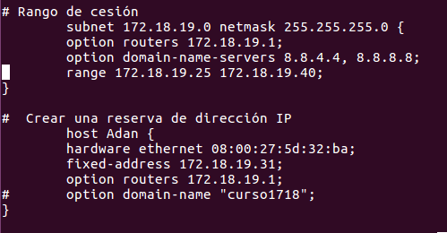
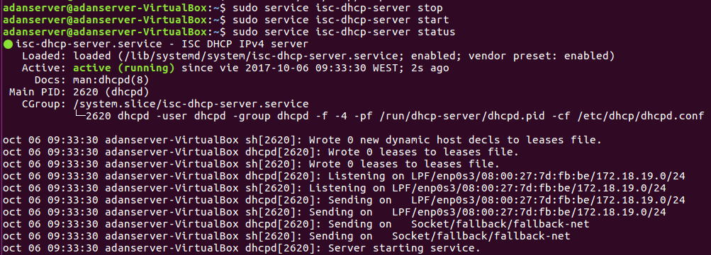

# **Instalaciones del servidor DHCP en Linux**

# Creamos las máquinas.

* Tenemos que crear dos máquinas, una cliente y otra servidor.
  * La servidor le ponemos adaptador puente (temporalmente).
  * La cliente le ponemos red interna llamada "interna".

# Proceso.

* Encendemos la máquina **servidor** e instalamos el servidor DHCP utilizando el comando `sudo apt-get install isc-dhcp-server`.

* Vamos al archivo de configuración del servidor *dhcp*, la ruta es `/etc/dhcp/dhcpd.config`
  * Comentamos todas las líneas que aún no estén comentadas, y haremos nuestra propia configuración.
  * Creamos un rango de cesión primero, de manera que cogemos la *subnet que vamos a utlizar, su máscara, el gateway por defecto, los servidores DNS y el rango de IPs*.
  * Acto seguido creamos una reserva de dirección para la máquina cliente, con lo que pondremos su dirección **MAC** y la IP que tendrá.

* Ahora reiniciamos el servidor DHCP.
  * Primero utilizamos `sudo service isc-dhcp-server-stop`
  * Y luego igual, pero en vez de `stop`, con un `start`.
  * Para comprobar que funciona, `sudo service isc-dhcp-server-status`.

# Comprobación.

* Por último vamos a la máquina **cliente**, y esperamos un poco, o bien, reiniciamos.
  * Hacemos un `sudo ifconfig` para comprobar nuestra IP, y podemos ver que tenemos la IP ofrecida por el servidor DHCP.

