# Servicios de Mensajería instantánea
Siguiendo los pasos detallados en las guías y tutoriales proporcionados:

* Comprobar que en tu servidor Windows 2012 están instalados y funcionan correctamente: IIS,
PHP, MySQL y phpMyAdmin.

* Descargar e instalar el servidor de mensajería instantánea OpenFire para Windows.

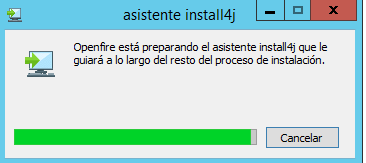

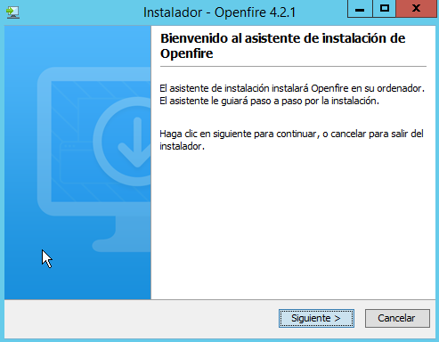

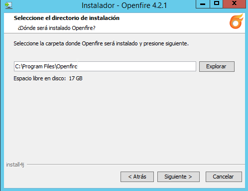

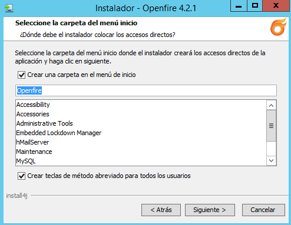

* Iniciar (Start) el servidor de mensajería Openfire.

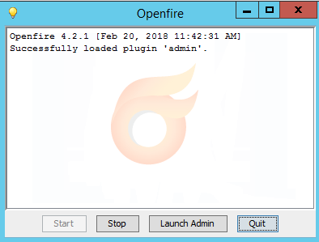
* Crear una base de datos en blanco en MySqQL a través de phpMyAdmin y recordar nombre de la
BD, así como usuario y contraseña con privilegios.

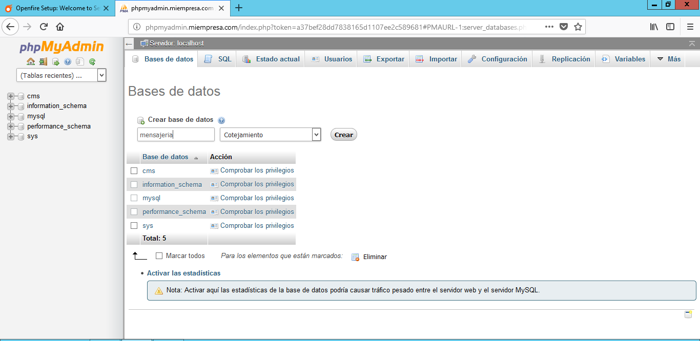

* Ejecutar el script de instalación de Openfire desde un navegador web del servidor, mediante la url
http://127.0.0.1:9090. (openfire trabaja con los puertos 9090 y 9091 –https-).

* Seguir las instrucciones del documento PDF de Servicio de Mensajería en Windows para
seleccionar las distintas opciones de instalación y configuración de Openfire.

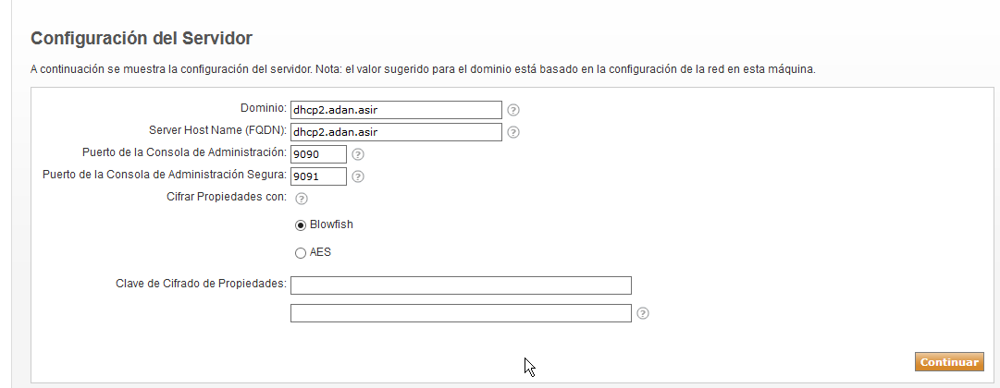

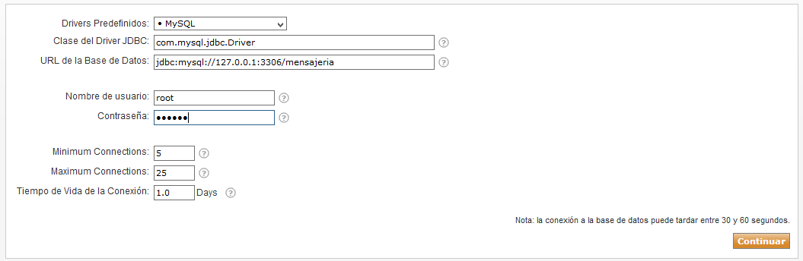

* En la primera pantalla de “Seteos de Perfil” seleccionar la opción “Por Defecto” en lugar del
“Servidor de Directorio (LDAP)” que se recomienda en el tutorial de instalación.

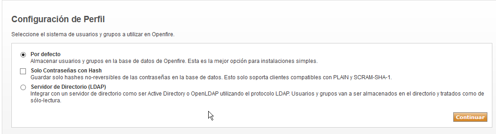

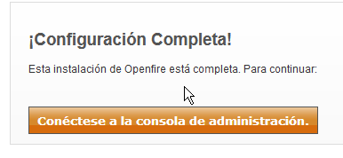
* Una vez completada la instalación, acceder a la consola de administración de Openfire con el usuario administrador creado. Comprobar este acceso tanto desde el servidor como desde una
máquina cliente.
* Una vez instalado el servidor OpenFire, vamos a descargar e instalar un cliente de Mensajería:

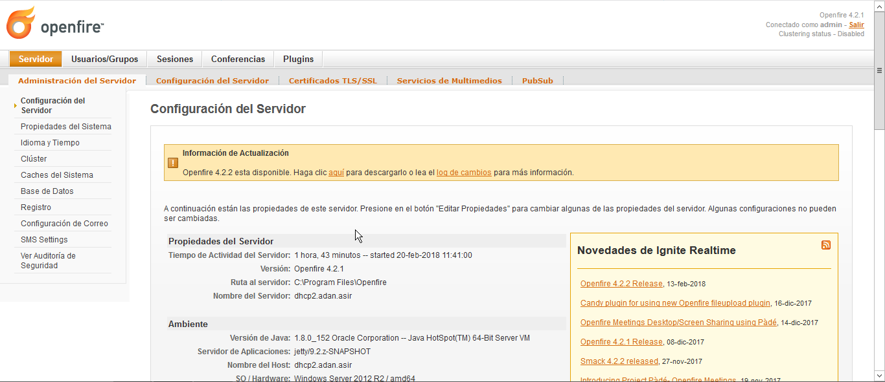

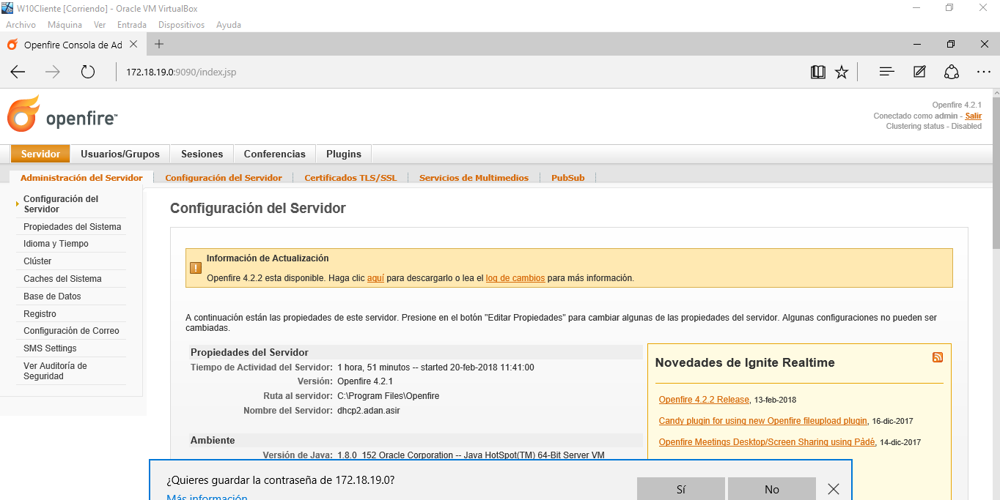
* Descargamos el cliente de mensajería Spark

* Instalamos Spark en nuestro servidor Windows Server

* Instalamos también Spark en nuestro cliente Windows 7

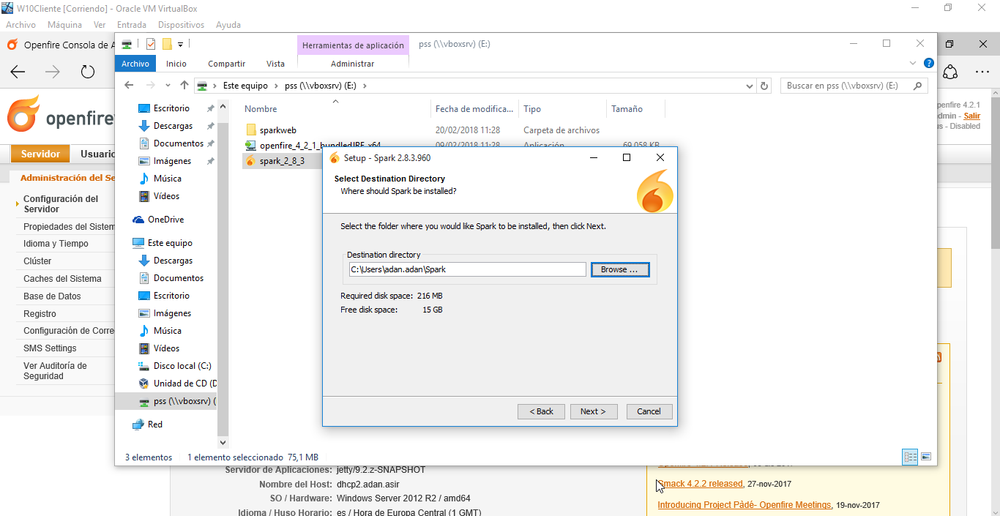

* Ahora vamos a crear dos nuevos usuarios en OpenFire (además del administrador) para poder
mantener una conversación entre cliente y servidor.

* Ejecutar Spark tanto en el cliente como en el servidor, validarse en cada uno de ellos como un usuario diferente de los que hemos creado y mantener conversaciones entre ambas máquinas
usando los clientes de mensajería. Para ello debes investigar como invitar usuarios, crear cuartos
de conferencia, iniciar conversaciones, iniciar conferencias, transferir archivos y capturas de pantalla, etc. Comprobar e informar acerca de estas y otras opciones de configuración tanto
desde Sparks como desde OpenFire.

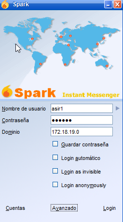

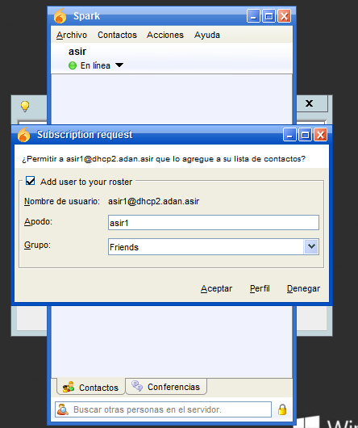

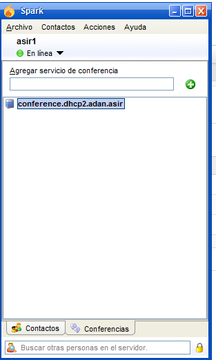

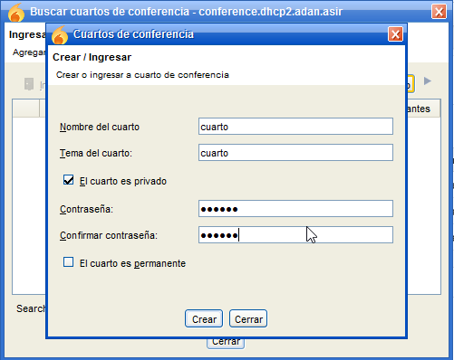

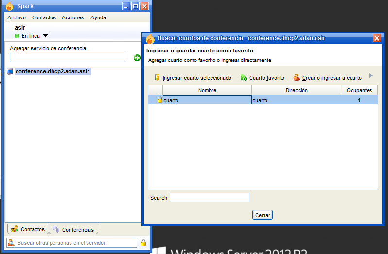

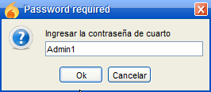

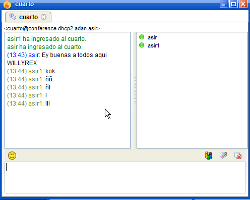

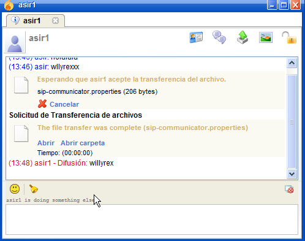

* Instalar, probar e informar FastPath WebChat (documento pdf) o SparkWeb de OpenFire.

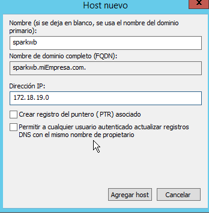

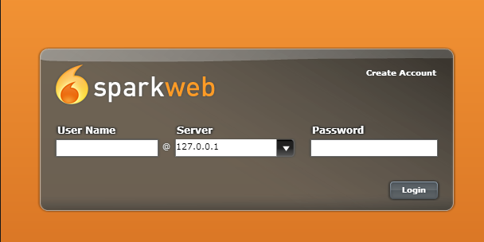
