# Práctica Servicio SMTP Windows 2012 Server

---

* Instalar Servicio SMTP en Windows 2012 Server (manualmente o utilizando Asistente).

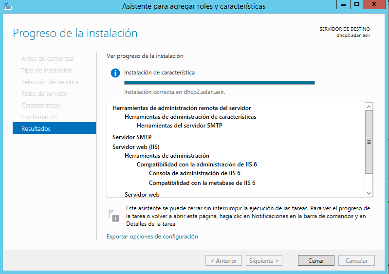

---

* Configuración de servicio SMTP a través del administrador de aplicaciones (IIS) 6.0. Realizar las siguientes acciones de configuración:
  * Establecer como IP todas las asignadas
  * Limitar el número de conexiones a 50

  * Habilitar el registro en formato W3C, diario y en una carpeta determinada

  * Configurar envío de mensajes dentro de nuestra red local: Aceptar la conexión al servidor y la retransmisión de mensajes a todos los equipos menos los que aparecen en la lista (incluir una IP cualquiera en la lista para impedir su acceso y retransmisión)
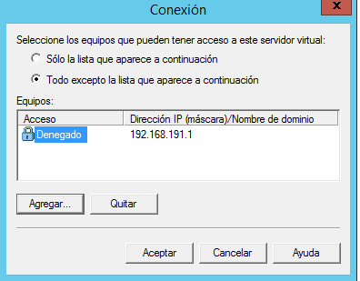

  * Establecer autenticación anónima
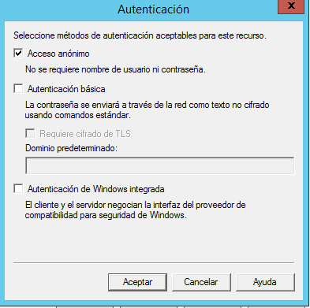

  * Echar un vistazo al resto de opciones de configuración del servidor. Aplicar cambios y reiniciar servicio.
  * Comprobar la existencia del dominio AD predeterminado. Crea un dominio de tipo alias para disponer de cuentas en otro dominio.
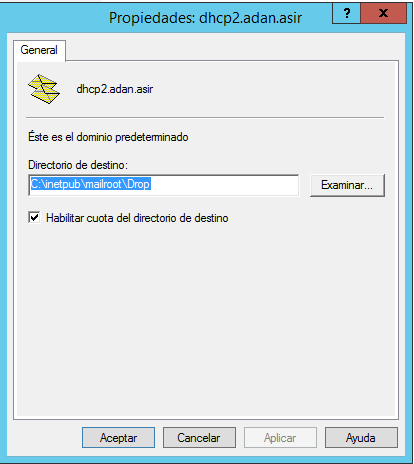
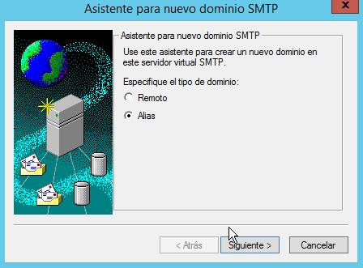

  * Comprueba carpetas de correo creados en C:\Inetpub\mailroot.

---

* En el cliente Windows:
  * Comprobar acceso al nuevo nombre DNS creado en el servidor.
  * Configurar el cliente de correo Live mail agregando dos cuentas de correo cualesquiera (usuarios AD -dominio- y no AD). Se deberá especificar: usuario / buzón, contraseña,  servidor SMTP.
  
  * Enviar varios correos desde / hacia las diferentes cuentas y comprobar envío (real o ficticio) y carpetas mailroot. Las carpetas existentes en mailroot alojan mensajes en cola (Queue), mensajes para destinatarios desconocidos (Badmail) y mensajes entregados (Drop)
  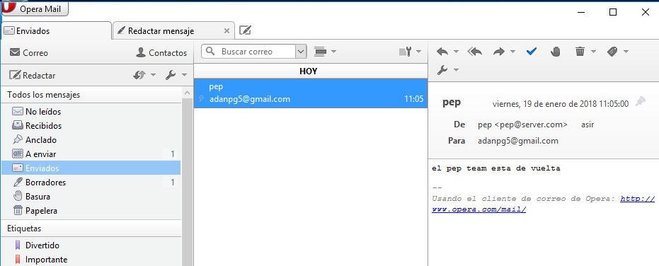
  
  * Nueva configuración de servicio SMTP a través del administrador de aplicaciones (IIS) 6.0. Establecer autenticación básica de Windows. * Probar diferentes configuraciones de dominio predeterminado, cifrado TLS, etc.
  
  

  * En el cliente Windows:
  * Configurar las cuentas según los parámetros especificados en el servidor. Enviar varios correos desde / hacia las diferentes cuentas y comprobar envío y carpetas mailroot. En este caso sólo tendrán acceso al servidor SMTP cuentas del dominio y correspondientes a usuarios de AD.
  
  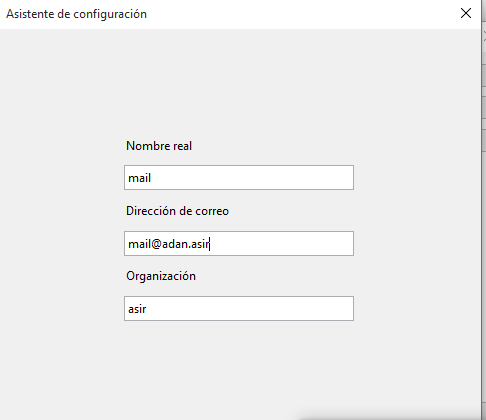
  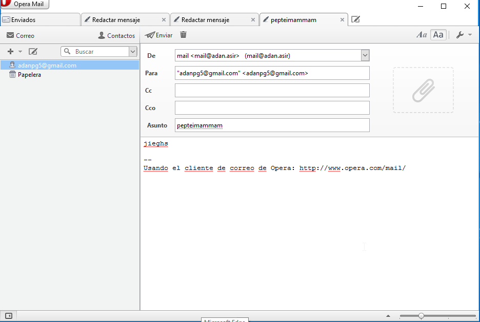
  

---

# Configuración de hMailServer en Windows Server 2012

* En primer lugar, hay que desinstalar el servicio SMTP de Windows 2012 Server.
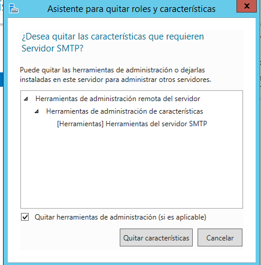
* Debes descargar e instalar en el servidor Windows 2012 server el servidor de correo hMailServer.
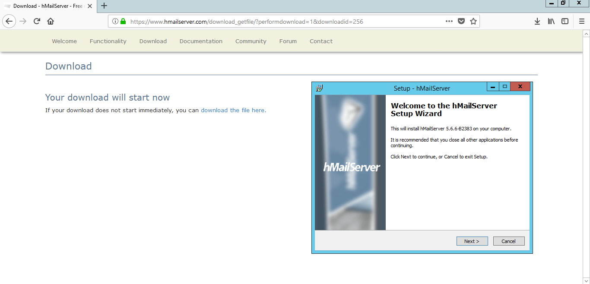
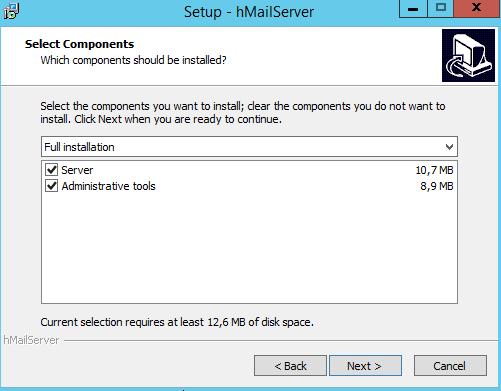
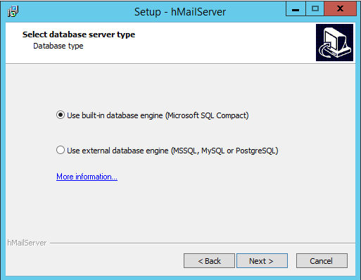
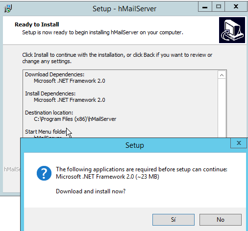

* Crea dos dominios denominados srd.edu y asir.edu.
* Ejecuta los diagnósticos para ambos dominios y soluciona el error de backup asignando una carpeta para tal fin. Establece copia de seguridad de los mensajes.
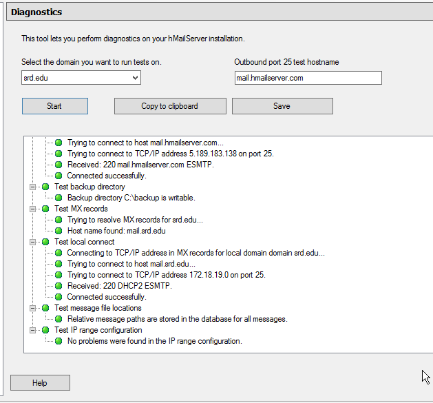

* Crea dos cuentas para dos usuarios ficticios en cada uno de los dos dominios. Investiga y configura las cuentas con diferentes opciones (cuota de disco, auto-reply, forwarding, signature, etc.)

* Configura el servicio DNS para crear las entradas mail.srd.edu y mail.asir.edu que apunten a la dirección ip del servidor windows 2012.

* Realiza todas las opciones de configuración que consideres necesarias y/o convenientes. Consulta para ello los tutoriales cuyos enlaces se proporcionan (opciones de protocolos SMTP, POP e IMAP, rangos de IP, bloqueo de correo entrante, nombre de host, reenvío dominios remotos, blacklists, opciones de logging, etc.)

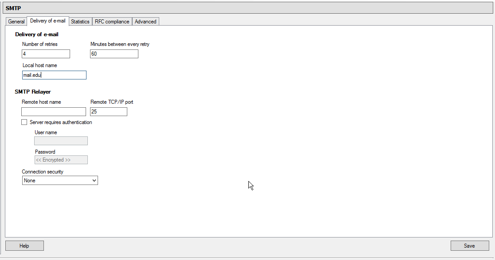
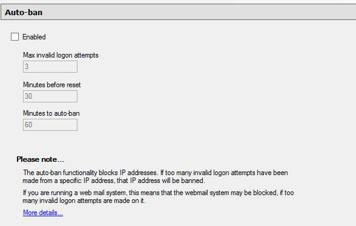

* Configura en el cliente W7 un cliente de correo como thunderbird o Live Mail (en los ordenadores clientes) para acceder al servidor de correo instalado en Windows 2012.

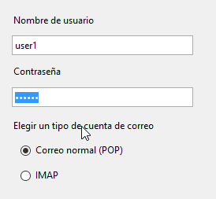

* Realiza prueba de envío y recepción de correos entre los diferentes usuarios, comprobando, además de envío y recepción correctas, el efecto de las opciones configuradas en las cuentas.

---
