* Descargar e instalar el paquete IceCast (Servidor de Audio): `apt-get install icecast2`

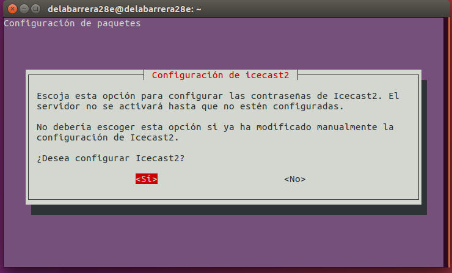

* Editar el fichero `/etc/icecast/icecast2.xml` y modificar las siguientes líneas:

* Editar el fichero `/etc/default/icecast` y modificar la siguiente línea:
 *ENABLE=true*

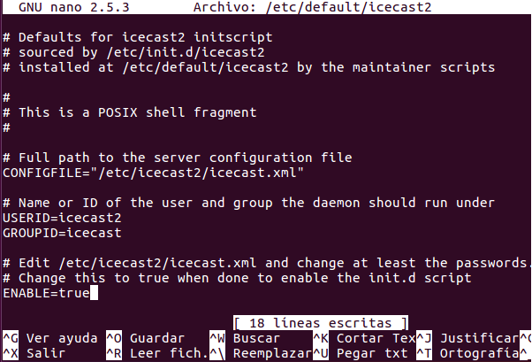

* Iniciar el servicio correspondiente a Icecast:

* Instalar el codificador vorbis ices2:

* Crear el directorio para el codificador y copiar el fichero de configuración por
defecto:

* Editamos el fichero de configuración del codificador y establecemos los
parámetros de nuestra emisora mediante las siguientes etiquetas:

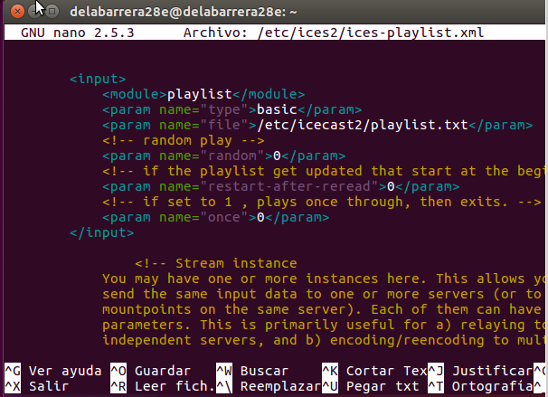

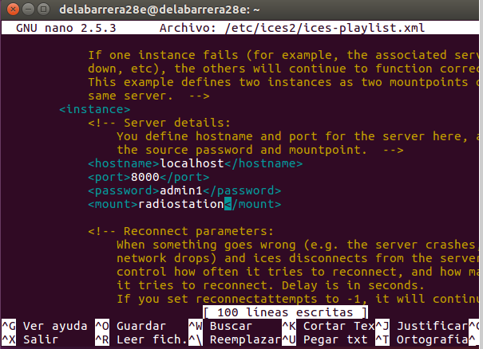

* Recopilar unos cuantos ficheros de audio en formato ogg y copiarlos en el
directorio /tmp/música

* Generar la lista de reproducción:

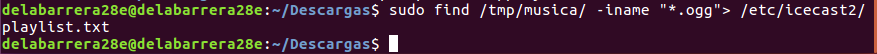

* Crear el directorio log de ices2:

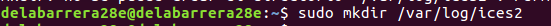

* Ejecutar el codificador en background:

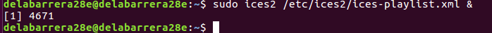

* o Procedemos a acceder al entorno web de información y administración de nuestro
servidor de audio Icecast, a través de la IP (o nombre DNS) del servidor y el puerto
configurado anteriormente (8000). Acceder con el nombre de usuario y
contraseña que establecimos en la configuración.

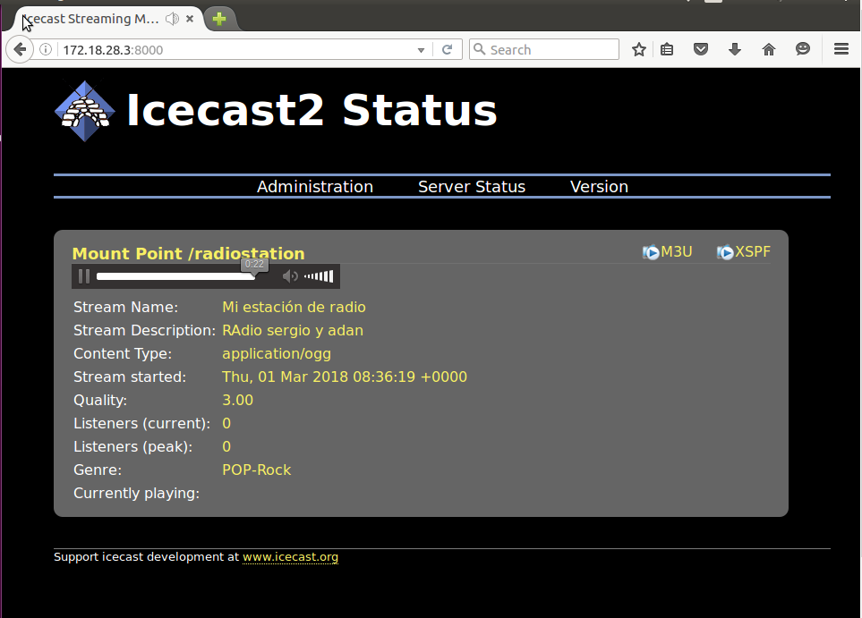

* Comprobar estado del servicio, configuración y propiedades. Comprobar asimismo
punto de montaje (Mountpoint) asociado a la lsita de reproducción creada y
propiedades

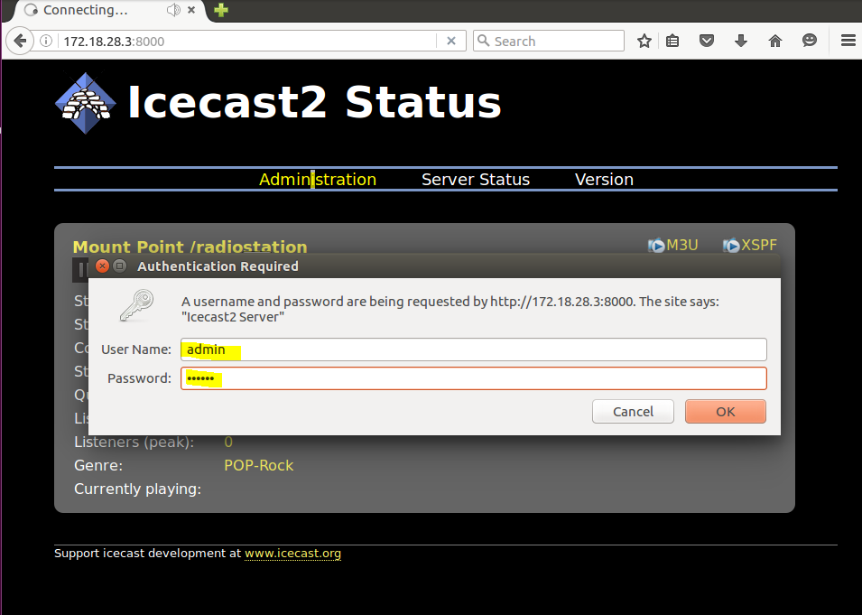

* Acceder vía web a la lista de reproducción (mountpoint) desde el propio servidor
(IPServidor:puerto/mountpoint).

* Acceder desde un posible cliente (Linux o Windows), a través de un navegador,
tanto al entorno de administración como a la reproducción de la lista.

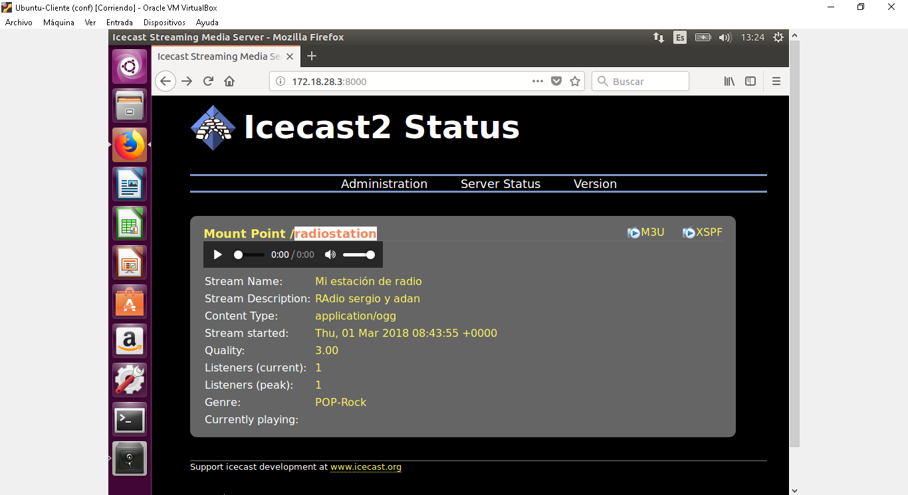

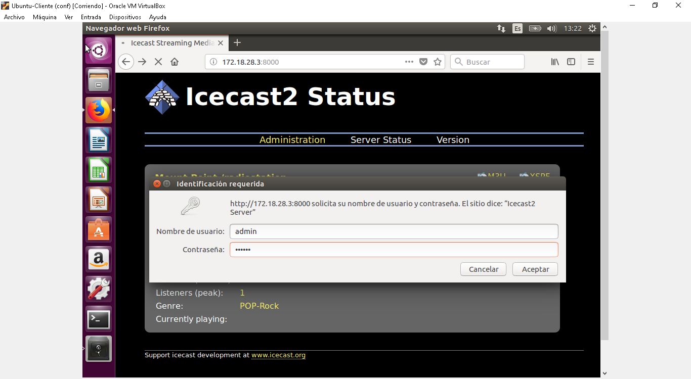

* Tratar de realizar una reproducción del streaming de audio creado utilizando un
software reproductor multimedia desde el cliente (URL-> IP:puerto/mountpoint).

