* Servidor (W2012): Registrarse, descargar e instalar el software para central PBX 3CX Phone System (http://www.3cx.es/) y el SIP softphone 3CX Phone.

* Para la
 instalación del servidor PBX se necesita .NET Framework 4.5 y seguir los
pasos
seleccionando
la opción de servidor que consideres adecuada e IIS como
servidor web asociado al panel de control de 3CX.

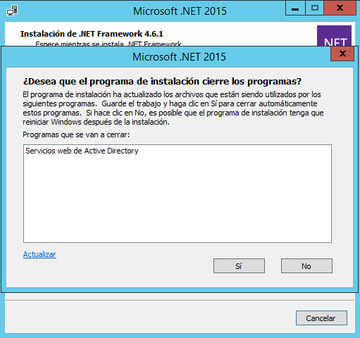

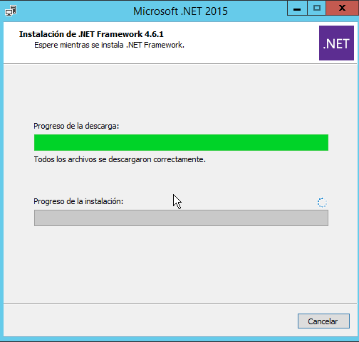

* Comprobar  en el  sitio  web  asociado  al  panel  de  control  de  3CX  Phone  
System.  Iniciar  dicho  panel  de  control  y  realizar  las  siguientes  acciones
  de
configuración:
  * Seleccionar extensiones de 3 dígitos y configuración regional adecuada.
  * Configurar los datos del usuario operador.
  * Seleccionar países con los que se podrá establecer comunicación.
  * Comprobar funcionamiento correcto entrada DNS.

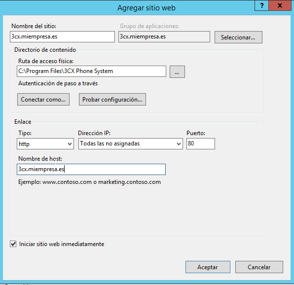

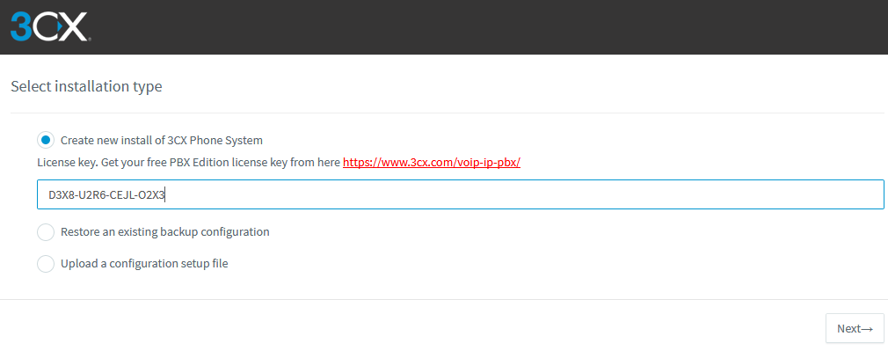

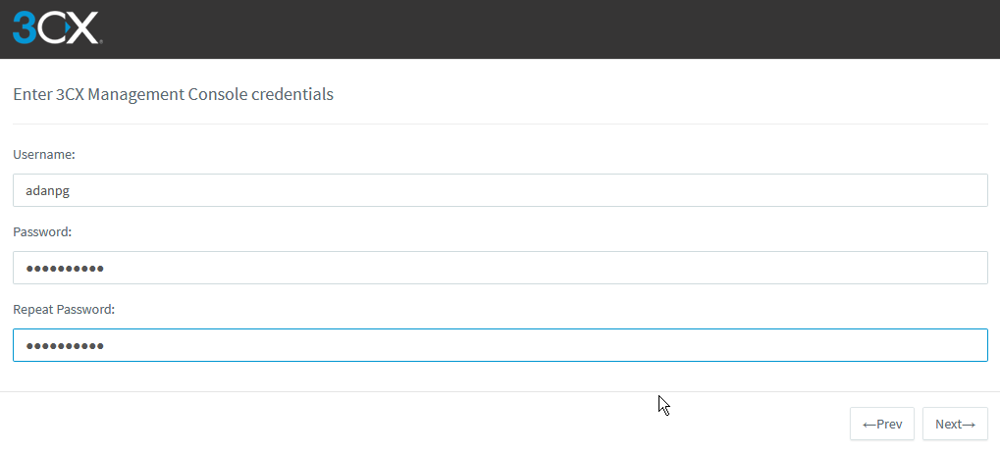

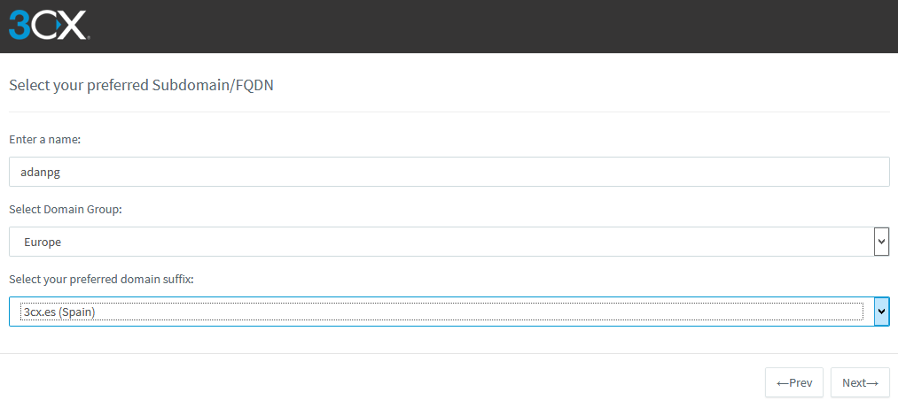

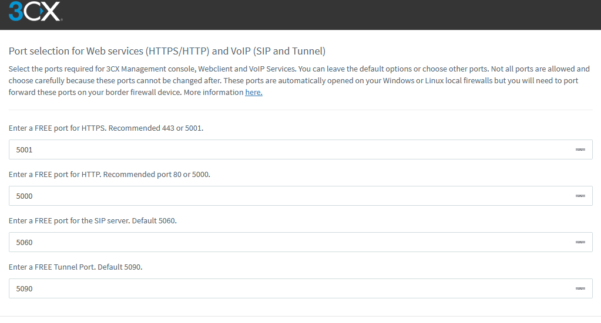

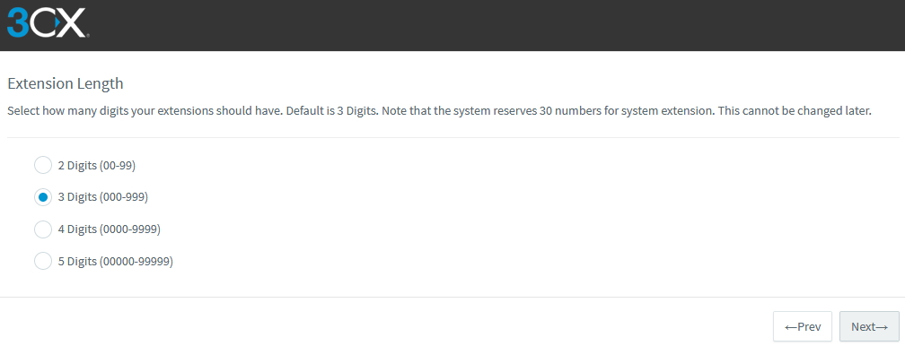

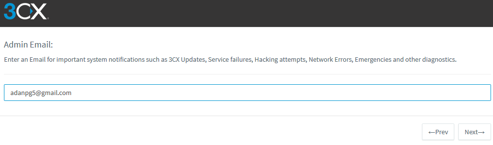

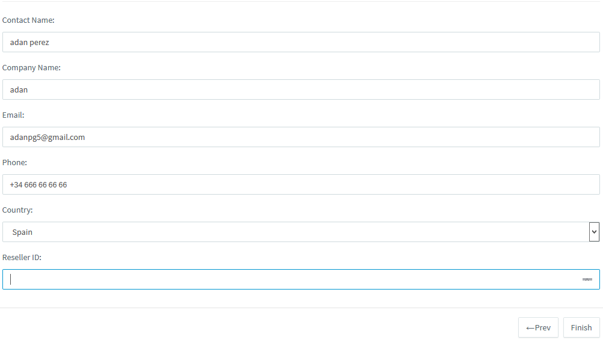

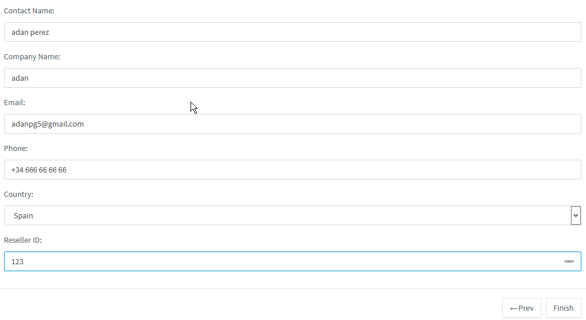

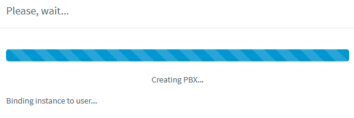

* Crear,   al   menos,
tres
   extensiones   correspondientes   a   diferentes
usuarios con toda su información.
o
Investigar
 acceso desde Smartphone apps a través de
 PUSH.

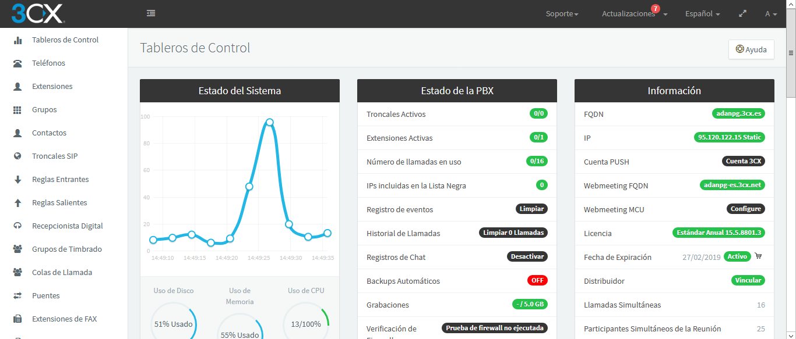

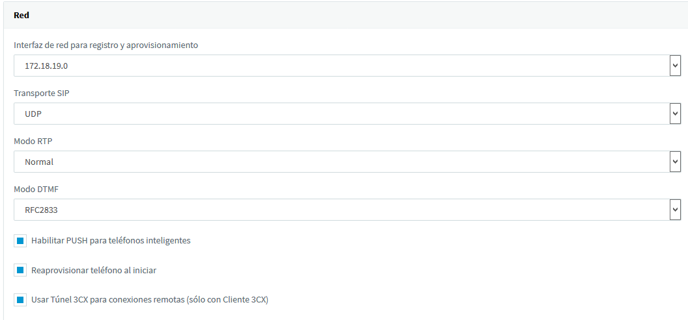

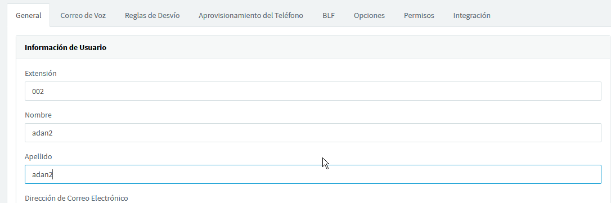

* Cliente
PC
(W7  o  similar):  Descargar  e  instalar  el  software  SIP  softphone  3CX  
Phone
 for Windows
.
  * Cliente Smartphone
: Descargar e instalar app 3CX Phone o similar.

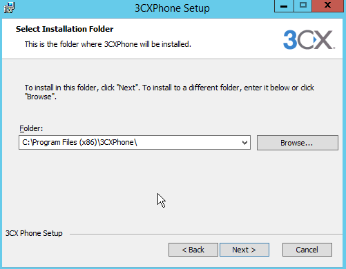

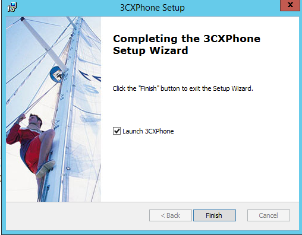

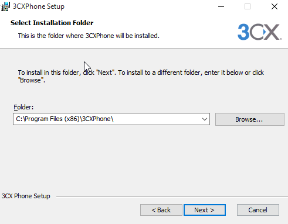

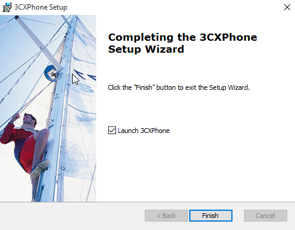

* Servidor  y  Clientes:  Realizar  la  instalación  y  configuración  completa  del  3CX  
Phone
  siguiendo  las  los  enlaces  y  manuales  tanto  en  el  servidor  como  en  
los
cliente
s  con  el  fin  de  establecer  una  comunicación  interna  de  voz  entre  los  
usuarios.  Crear las cuentas correspondientes a los usuarios en cada terminal.

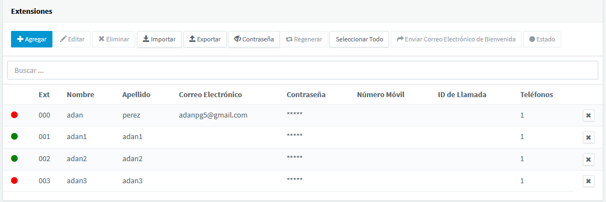

* Efectuar   llamadas   entre   los   usuarios   correspondientes   a   las   extensiones   
creadas en el servidor. Efectuar pruebas con las diferentes opciones existentes:
dejar   mensajes   en   contestador,   escuchar   los   mensajes,   contactar   con   el   
operador, etc.

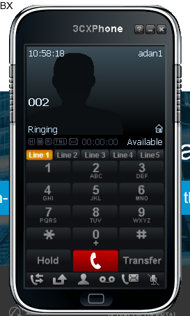

---

* **Trabajo realizado por**:

*Adán Pérez*

*Sergio de la Barrera*

---
