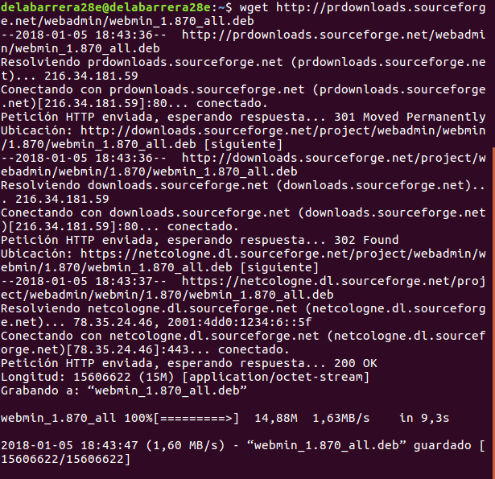
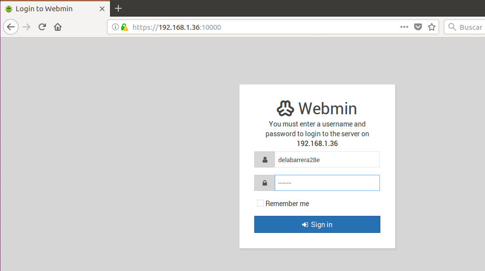
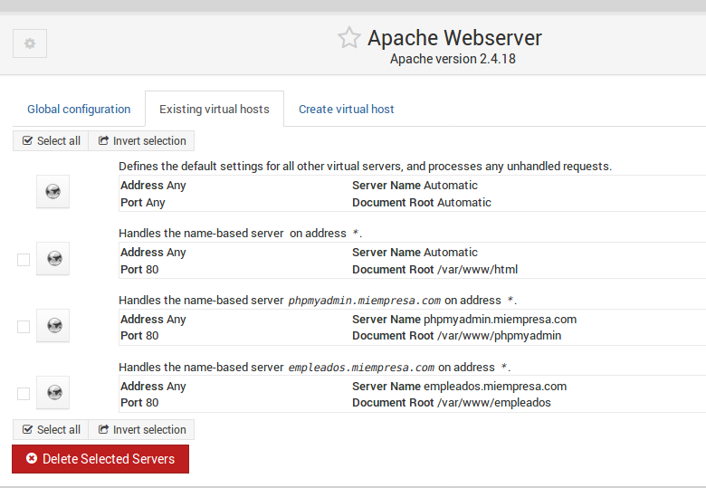
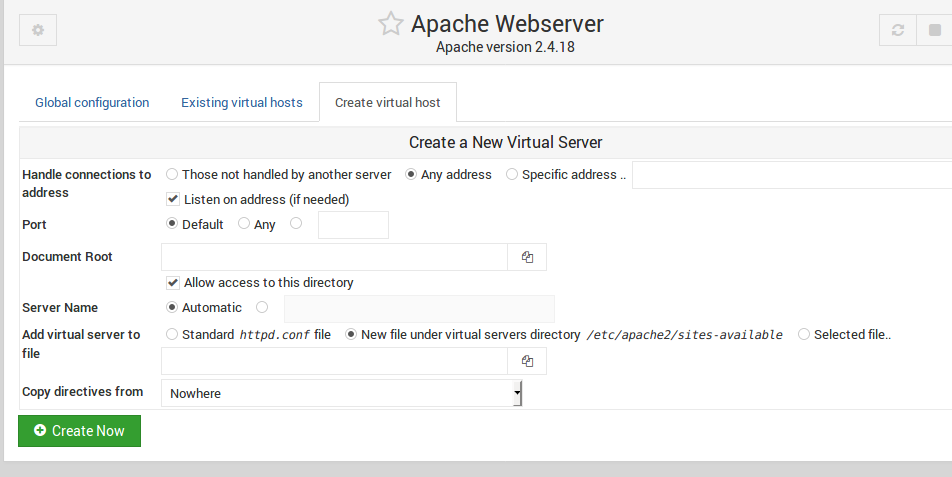
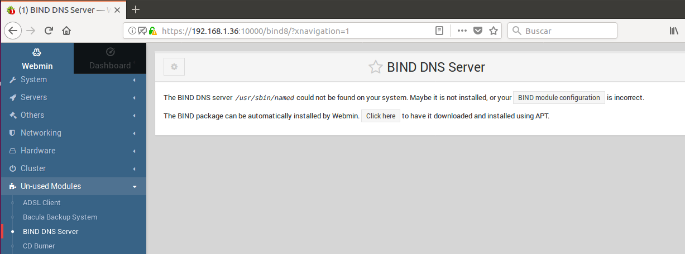
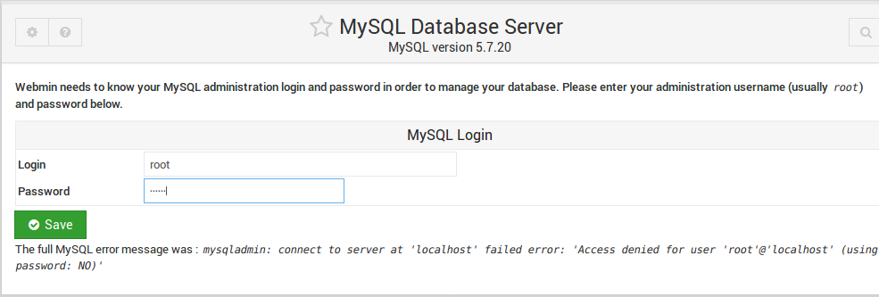
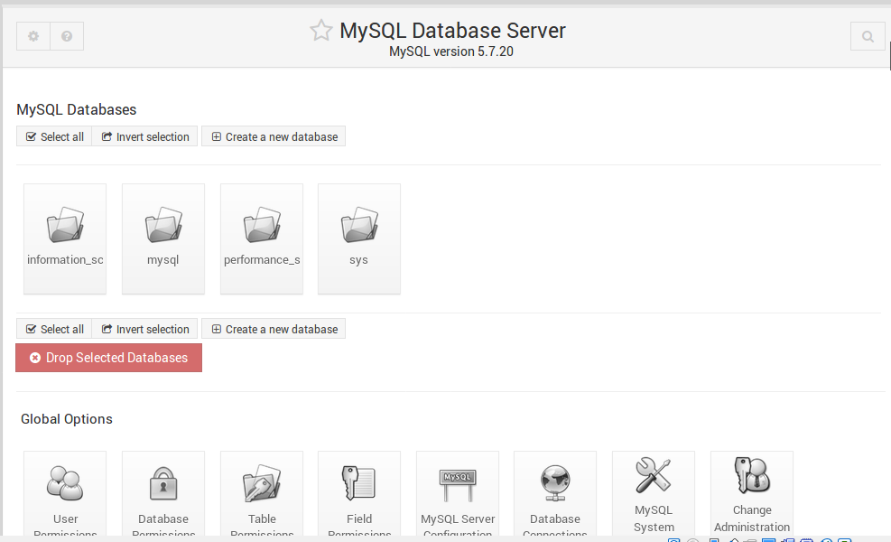
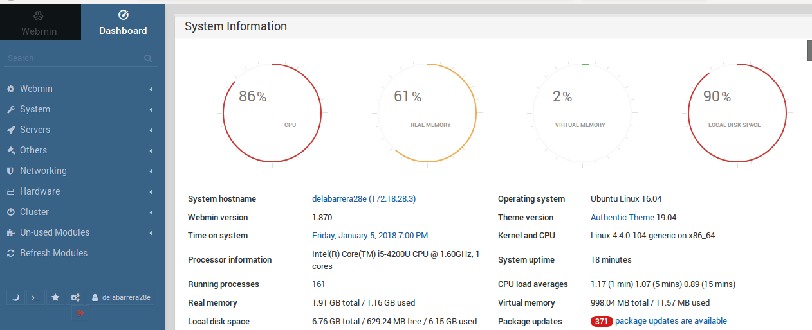
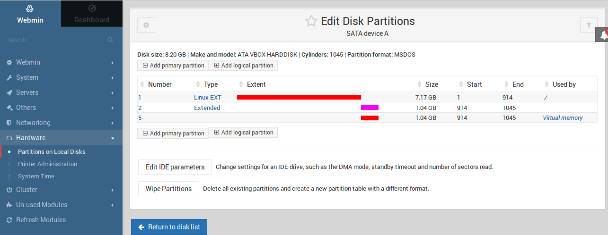

# Instalación de un panel de control para servicio de hosting web.

* El primer paso será instalar el panel de control, que lo haremos a través de la página oficial, en nuestro caso, de **webmin**.

* Una vez descargado, procedemos a su instalación.

* Podemos empezar a utilizarlo accediendo desde un navegador. Webmin por defecto utiliza acceso por https y el puerto 10000.

* Al acceder a la web nos pide un usuario y contraseña, estos usuarios utilizan a los usuarios de UNIX, por lo que utilizaremos el usuario real de nuestra máquina.

* Ya habiendo accedido, ahora podemos gestionar los servicios que nuestra máquina ya tiene instalados.

* En la opción Apache Webserver editamos las opciones de nuestro servidor.

* En el servidor DNS tenemos una interfaz con la que podremos modificar las opciones del propio servicio, como por ejemplo parar/arrancar el servicio y guardar cambios.

* Para poder acceder al servidor mysql nos pedirá primero un usuario administrador.

* Desde aquí podremos gestionar nuestras bases de datos y las opciones globales del servidor.

 También contamos con otras funciones como:

* Saber los recursos que esta consumiendo nuestro servidor.

* Comprobar las particiones de nuestro disco.

* Modificar parámetros de idioma y tema de la aplicación

---

Actividad realizada por: Adán Pérez García y Sergio de la Barrera.
